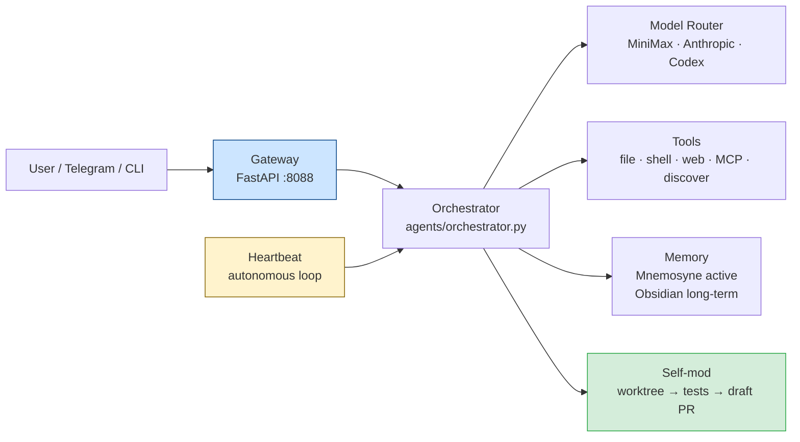

# HiveOS — Autonomous Jarvis-like Agent (Hive)

HiveOS is the system; **Hive** is the agent. He runs 24/7 on a Hetzner VPS, talks to you in
**Polish**, builds in **English**, executes on **MiniMax** (Token Plan), reserves **ChatGPT Plus**
for heavy thinking, remembers everything (**Mnemosyne** active + **Obsidian** long-term),
reuses before building (**discovery-first**), and self-improves — changing his own code only
through **pull requests you merge**, never auto-merging to live.

## Documentation

| Document | What it covers |
|---|---|
| [`docs/ARCHITECTURE.md`](docs/ARCHITECTURE.md) | How the system is built and why — authoritative design reference with Mermaid DAG and standout engineering |
| [`docs/STATUS.md`](docs/STATUS.md) | Living capability matrix — what's done, what's wired, what's deferred |
| [`docs/API.md`](docs/API.md) | Gateway HTTP/WS endpoint reference with request/response shapes and curl examples |
| [`docs/CONFIGURATION.md`](docs/CONFIGURATION.md) | All 33 environment variables with precedence rules and common configuration profiles |
| [`docs/DEVELOPMENT.md`](docs/DEVELOPMENT.md) | Local dev setup, layer DAG, test patterns, architectural rules |
| [`docs/DEPLOYMENT.md`](docs/DEPLOYMENT.md) | Production VPS setup — systemd units, Mnemosyne, nginx, Telegram |
| [`docs/CONTRIBUTING.md`](docs/CONTRIBUTING.md) | PR workflow, branch naming, commit format, review checklist |
| [`docs/SECURITY.md`](docs/SECURITY.md) | Threat model, three-tier self-mod gate, PROTECTED files, credential security |
| [`docs/GLOSSARY.md`](docs/GLOSSARY.md) | ~30 domain-specific terms defined |
| [`docs/CHANGELOG.md`](docs/CHANGELOG.md) | Milestone history from P0 foundation to present |
| [`docs/decisions/`](docs/decisions/) | 5 Architecture Decision Records (SQLite, MiniMax, no-auto-merge, core-is-leaf, edit-pending) |
| [`docs/BUILD_GUIDE.md`](docs/BUILD_GUIDE.md) | Historical phase runbook (P0–P9, for context only) |

## Quick install

```bash
curl -sSL https://raw.githubusercontent.com/hiveosagent/hiveos/main/install.sh | bash
hive init   # first-time setup wizard
```

Or manually:

```bash
pip install -e ".[memory]"
hive init
```

## Quick local check

```bash
pip install -e ".[dev]"      # editable install with test deps
cp .env.example .env         # then add at least MINIMAX_API_KEY and HIVE_SECRET
hive doctor --fix            # verify SOUL + env + state DB
hive ask "say hi"            # one-shot turn
hive serve                   # gateway on :8088 (chat, SSE, approvals, budget…)
# OpenAI-compatible endpoint (drop-in for any OpenAI SDK client):
# curl -s http://localhost:8088/v1/models -H "Authorization: Bearer $HIVE_SECRET"
hive mcp-serve               # expose Hive's tools as an MCP stdio server
hive heartbeat               # 24/7 autonomy loop (cron + commitments + tasks)
hive consolidate             # one sleep-time memory consolidation pass
ruff check src/ tests/       # lint (code style gate)
pytest -q                    # ~825 tests, skips vary with optional deps, no network needed
# optional: build Mission Control dashboard
cd dashboard && npm ci && npm run build && cd ..   # hive serve mounts it at /app
```

## Layout

```
Config/SOUL.md            PROTECTED — immutable identity + rules
Core/approval_gate.py     PROTECTED — danger firewall (regex patterns + tool allowlist)
src/hive/                 installable `hive` package
  core/      registry · events · types · config · doctor · credentials
             soul+approval (read-only bridges) · self_mod · spec_search
             · budgeter · sandbox · redact
  llm/       router · failover · credential_pool · model_catalog · pricing
             · rate_limit · sanitize · host_bridge
             · adapters/{base,minimax,anthropic,codex}
  agents/    base · orchestrator · executor · loop_guard · delegate · planner
  memory/    provider · mnemosyne_provider · local · keeper · vault
             · curator · skill_usage
  context/   session_store · compaction · prompt_builder · title
  tools/     base · registry · executor · file_safety · shell_provider
             · discovery · builtins · mcp/{client,server}
  gateway/   app (FastAPI) · protocol · auth · channels/{base,telegram}
  autonomy/  heartbeat · cron · tasks · commitments
  surfaces/  cli · voice
  observability/ telemetry · traces · audit
  runtime.py  HiveOS dataclass + HiveOS.build() — composition root
.claude/agents/  researcher · coder · reviewer · memory-keeper · security-reviewer
tests/       pytest suite (~825 passing; optional-dep skips vary)
docs/        ARCHITECTURE · STATUS · CONFIGURATION · API · DEVELOPMENT · DEPLOYMENT
deploy/      systemd units (gateway · orchestrator · keeper timer)
dashboard/   Vite + React SPA (Mission Control)
```

## Architecture (3-layer summary)



`Config/SOUL.md` and `Core/approval_gate.py` are PROTECTED — unmodifiable by Hive.
All self-mod changes go through a PR that Kamil reviews and merges; Hive never self-merges.

## The invariants

- `Config/SOUL.md` + `Core/approval_gate.py` are human-only — never edited by agents
- Hive never merges to `main` — all changes go through PR → human review → merge
- Discovery-first: search before building; record in memory; never re-research
- Once learned, always remembered (Mnemosyne active layer)
- Polish to Kamil / English in all code, commits, docs, PRs
