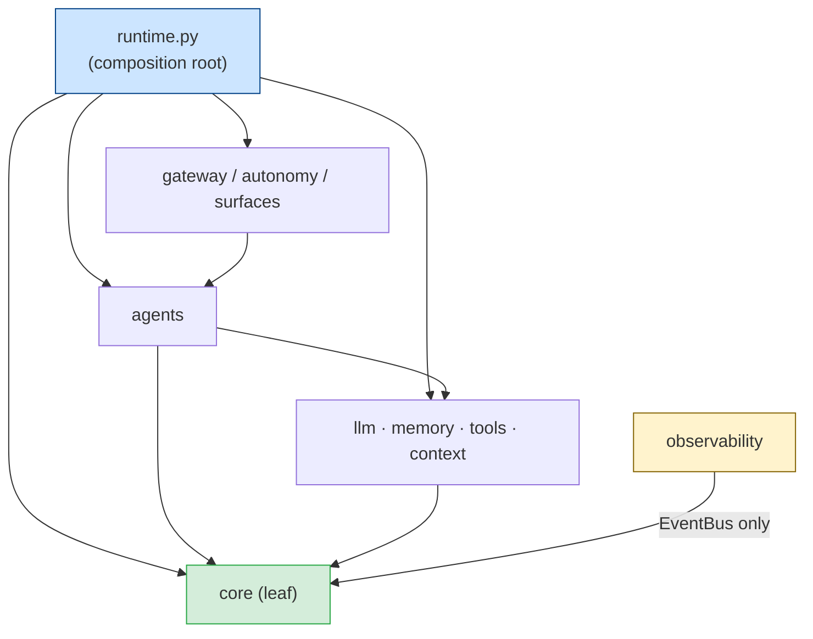

# HiveOS — Architecture (authoritative, current system)

> **This documents the system as actually built** (the installable `hive` package),
> with every claim citing a real `src/hive/...` path. Companions:
> `docs/STATUS.md` (what's done / gaps) and `docs/references/HIVEOS_COMPONENTS.md`
> (per-module table). The original *plan* lives in `docs/references/SYNTHESIS.md`
> (historical). Part II below keeps the design **rationale** (the "why").

HiveOS is the system; **Hive** is the agent. Python-first, async, installable as `hive`.

The dashboard also contains an isolated UI concept preview selected by the
`?ui-preview=1` query flag (`dashboard/src/ui-preview/`). It uses static fixtures,
does not construct `Centre`, does not require a Hive token and performs no gateway
requests. Its purpose is to validate page hierarchy and future API contracts. It is
not a production surface; see `docs/UI_RELATIONS_AND_API.md`. The 29-state interaction
and responsive audit is recorded in `docs/UI_AUDIT_2026-08-22.md`.

> **Coverage confidence** (mirrors Hermes/OpenJarvis reference style)
>
> | Section | Coverage | Notes |
> |---|---|---|
> | runtime.py / composition root | **A** — exhaustive | Every field and build-time wire documented |
> | gateway / API surfaces | **A** — exhaustive | 100+ endpoints across 19 groups; see also `docs/API.md` |
> | core/spec_search + self_mod | **A** — exhaustive | Full tiered loop, PROTECTED guard, worktree lifecycle |
> | llm / adapters / failover | **B** — sampled | Key paths; pricing + rate-limit headers sampled |
> | memory / Mnemosyne + local | **B** — sampled | Provider contract and host-LLM bridge covered; BEAM/sleep internals deferred to Mnemosyne docs |
> | autonomy / heartbeat | **B** — sampled | Tick sequence described; cron/commitment internals enumerated |
> | tools / MCP client+server | **B** — sampled | Build-time wiring; stdio vs SSE transport noted |
> | surfaces / CLI / voice | **C** — enumerated | Commands listed; voice needs audio host (VPS deferred) |
> | observability | **B** — sampled | Three modules; event types listed in section 6; new diagnostic methods in section 4 |

---

# Part I — The built system

## 1. Identity & safety spine (never bypass)
- `Config/SOUL.md` — immutable identity + safety contract. Loaded read-only via
  `src/hive/core/soul.py` (lazy, PEP 562). **Never edited/moved.**
- `Core/approval_gate.py` — the danger firewall. Reached read-only via an `importlib`
  bridge in `src/hive/core/approval.py` (re-exports `gate`, `PROTECTED_PATHS`,
  `DANGEROUS_TOOLS`). **Never edited/moved.**
- `src/hive/core/approval.py` adds a fail-closed containment layer around the
  immutable gate: shell commands must match the small read-only allowlist, shell
  metacharacters and malformed/missing commands require approval, and protected
  paths are compared case-insensitively after separator and dot-segment
  normalization.
- `src/hive/tools/file_safety.py` anchors repository-sensitive paths to the
  installed package's repository root rather than the process CWD. It blocks
  sensitive repository paths for both read and write operations, keeps the
  credential/system denylist case-insensitive, and treats symlinks leaving that
  root as unsafe.
- Both are PROTECTED: `core/self_mod.py::_touches_protected` refuses any change touching
  them; the tool executor routes dangerous calls through the gate; Hive never merges to
  `main` (humans do).

## 2. Package layout (`src/hive/`)
```
core/    registry events types config doctor credentials soul approval
         self_mod spec_search budgeter sandbox          # leaf layer
llm/     router failover credential_pool model_catalog pricing rate_limit
         sanitize  adapters/{base,minimax,anthropic,codex}  # make_adapter registry
agents/  base orchestrator executor loop_guard delegate planner
memory/  provider mnemosyne_provider local keeper vault curator skill_usage
context/ session_store compaction prompt_builder
tools/   base registry executor file_safety discovery builtins  mcp/{client,server}
gateway/ app protocol auth  channels/{base,telegram}
autonomy/heartbeat cron tasks commitments
surfaces/cli voice
observability/ telemetry traces audit
runtime.py   # HiveOS dataclass + HiveOS.build() — composition root
```

## 3. Dependency DAG (enforced)
`core` is a **leaf** (imports nothing higher). `llm`/`memory`/`tools`/`context` →
`core`. `agents` → `core`+`llm`+`tools`+`memory`+`context`. `gateway`/`autonomy`/
`surfaces` → `agents`+`runtime`. `observability` subscribes to the EventBus only.
The composition root is `runtime.py` (top level, **not** in `core`, because it imports
every layer). Enforced by `tests/test_architecture.py`:


- a subprocess probe asserts `hive.core.*` (and memory/context/tools/observability)
  import no higher layer at import time;
- a **static AST scan** asserts no `hive.core/*` file imports a higher layer **even in a
  function-local import** (this caught a real `core→llm` leak once).
Consequence: cross-layer needs are **injected** (e.g. `memory.keeper` takes a
`Summarizer` callable; it never imports `llm`).

## 4. Composition root — `runtime.py`
`HiveOS.build(config=None, router=None)` constructs and wires every subsystem from a
frozen `HiveConfig`, then returns a `HiveOS` dataclass holding them. Inject `router`
to run fully offline (all tests do). Wiring highlights:
- Local operator surfaces (`hive ask` and `hive chat`) use the same runtime from any
  interactive shell or TTY, but do not activate validation for optional inbound webhooks.
  Gateway and external-channel hosts retain that fail-closed validation, so an incomplete
  Telegram, Slack, Discord, or email setup cannot block a local terminal conversation or
  weaken ingress authorization. `hive chat` constructs the local runtime before deciding
  that an executor credential is absent, so a key loaded from the native credential vault
  is accepted just like an environment key; no credential value is rendered. Terminal turns
  render the existing orchestrator lifecycle:
  requested tool names, start/end status, approval or loop-guard stops, and the final answer.
  They intentionally do not render raw model reasoning, tool arguments, or tool output; those
  may carry sensitive context and remain in the authorised audit/trace path.
- EventBus created per build (no cross-talk); budgeter, telemetry, traces subscribe.
  `ObservabilityLedger` owns append-only `telemetry`, `spend_reservations`, and
  `selfmod_history` tables in the existing state database. At startup it hydrates
  the telemetry projection and passes a local-day aggregate to the core budgeter
  without reversing the dependency DAG. The old JSON budget history remains the
  compatibility source for completed-day forecasting. `HIVE_DAILY_SPEND_CAP_USD`
  is an optional hard stop: before provider I/O the router atomically reserves a
  conservative request ceiling against finalized spend plus pending reservations.
  Non-streaming calls settle to measured usage; streams settle to their declared
  input/output ceilings because their API path does not reliably expose final usage.
  A timeout, cancellation, transport failure, or failed durable write keeps the
  reservation through restart to fail closed. `0` disables the cap for backward compatibility. At 80% and at
  the hard stop, alerts are transition-based but retry after a configured delivery
  failure. Local-day state clears naturally at the next local-day boundary. Fresh
  focused verification for this boundary is recorded in `tests/test_m1_spend_cap.py`.
- Router = `ModelRouter(adapter=MiniMaxAdapter, credential_pool, budget=budgeter.gate,
  spend_reserve=ledger.reserve_spend)`.
- Autonomous correlation (issue #126) = each `Heartbeat.tick()` creates a UUID in a
  task-local `ContextVar`. Schedulers and planner enqueues persist it on `hive_tasks`;
  a legacy/manual task adopts the dispatching tick's id when claimed, while a delayed
  task keeps its originating id. `ToolExecutor` writes the id to the tamper-evident
  audit row and to the learning `Tracer` as a distinct field (never as a conversation
  `session_id`). A pending approval is audit-only, not a learning failure; the durable
  approval sidecar restores the originating id for the later HTTP or Telegram decision
  and terminal execution, including after restart. Tool, approval, tick, and self-mod
  events carry the same id.
- Memory = `build_mnemosyne_provider(host_llm=…)` **or** `LocalMemoryProvider` fallback;
  when Mnemosyne is active its consolidation routes through HiveOS via `HostLLMBridge`
  (own dedicated loop + httpx client, so Mnemosyne's sync/threaded calls never touch the
  main loop). When the daily USD cap is enabled, HiveOS replaces the process-global
  Mnemosyne host backend with an inert fallback, preventing a pre-existing bridge
  from bypassing the reservation/accounting boundary. Adapter-level stream fallback
  is deliberately routed back through `ModelRouter`, so it receives a second,
  independently accounted reservation instead of hiding a second provider request.
- Tools = `register_builtins(_Registry, memory, github_token, telegram_token)` (incl. the
  discovery-first `discover` tool, real `external_message→Telegram`, gated `deploy→systemctl`);
  `ToolExecutor(tools, audit=audit_log.record)`. MCP servers from `HIVE_MCP_SERVERS`
  (stdio command lines or http(s):// SSE URLs, incl. `MNEMOSYNE_MCP_URL`) require an
  exact `HIVE_MCP_SERVER_PINS` SHA-256 `list_tools` manifest pin before registration.
  Loads and refusals are recorded in the audit/discovery trail. Server-controlled tool
  descriptions and nested prose annotations are bounded, control-character sanitised,
  and rendered through an untrusted `ContentEnvelope`; optional schema examples/defaults
  are omitted from model-facing definitions. Servers load at gateway startup (`HiveOS.load_mcp_servers`);
  Hive also serves its own tools over MCP
  (`HiveOS.serve_mcp` / `hive mcp-serve`). Credential pool seeded from the 0o600 vault
  (`credentials.inject`) + comma-split multi-key.
- Self-improvement = `SelfModifier(open_pr=github_pr_opener?, run=sandbox_run)` +
  `SelfImprovement(pending_store=edit_pending)`; the autonomous run id is included in
  the branch name, PR body, audit row, and durable self-mod history. Exact branch and
  PR URL indexes resolve back to the full UUID, and `GET /audit/search` accepts
  `run_id`, `branch`, or `pr_url` to return that run's audit chain. Skill lifecycle =
  `SkillUsageStore` + `Curator`.
- Autonomy = `TaskBoard` + `CronScheduler` + `CommitmentBook` (shared state DB).
- `HiveOS` fields: `edit_pending` (REVIEW-tier edits awaiting human approval);
  `agents_registry` (named specialist agents); `host_llm` (Mnemosyne bridge).
- `HiveOS` public methods: `ask`, `ask_stream`, `consolidate`, `curate`, `curate_umbrellas`,
  `discover`, `self_improve`, `self_improve_from_symptom`, `load_mcp_servers`, `mcp_server`,
  `serve_mcp`, `title_session`, `aclose`, `run_tests`, `self_diagnose`, `health`,
  `system_status`, `resume_after_restart`, `event_history`, `loop_guard_stats`,
  `reset_loop_guard`, `self_mod_history`, `recent_self_mod_branches`, `pending_review_edits`,
  `abort_all_self_mods`.

## 5. Data model (SQLite-first; no JSON sidecars for runtime state)
| Store (file) | Tables | DB |
|---|---|---|
| `context/session_store.py` | `sessions`, `messages` (+ `messages_fts`) | shared `state_db` |
| `memory/local.py` | `episodic`, `knowledge` (+ `knowledge_fts`) | shared `state_db` |
| `memory/skill_usage.py` | `skill_usage` | shared `state_db` |
| `autonomy/tasks.py` | `hive_tasks` (including per-run correlation) | shared `state_db` |
| `autonomy/cron.py` | `hive_cron` | shared `state_db` |
| `autonomy/commitments.py` | `hive_commitments` | shared `state_db` |
| `core/learning/storage.py` | `learning_traces`, `learning_loops` | shared `state_db` |
| `core/safety_state.py` | `approvals_pending`, `autonomy_cooldowns` | shared `state_db` |
| `observability/persistence.py` | `telemetry`, `spend_reservations`, `selfmod_history` | shared `state_db` |
| `observability/runs.py` | `hive_runs`, `hive_run_events` | shared `state_db` |
| `observability/audit.py` | `audit_log` (hash-chained, correlated by `run_id`) | `data_dir/audit.sqlite` |
| Mnemosyne (when installed) | its own schema | `mnemosyne_home` |
Each store self-initializes its schema (WAL). `core/doctor.py` verifies the DB is
present/openable; it does **not** duplicate store DDL (avoids drift — fixed in #14).
Named file artifacts (allowed): Obsidian vault notes (`memory/vault.py`), curator
backups (`data/backups/skills`), and a 0o600 credential-name manifest
(`core/credentials.py`). Credential values are stored in the OS keyring; legacy
plaintext vaults migrate only after the keyring write succeeds.

## 6. EventBus (`core/events.py`)
Thread-safe synchronous pub/sub; subscribers run in registration order, isolated from
each other's exceptions. **Contract: subscribers must be fast/non-blocking.** Producers
never call observability directly. Event types: `INFERENCE_{START,END}`,
`TOOL_CALL_{START,END}`, `MEMORY_{STORE,RETRIEVE}`, `AGENT_{TURN,TICK}_{START,END}`,
`APPROVAL_{REQUESTED,RESOLVED}`, `TELEMETRY_RECORD`, `BUDGET_BLOCK`, `SELFMOD_{START,END}`.
`INFERENCE_END` carries `{model, input_tokens, output_tokens, cost_usd}` → budgeter
(cost accumulator) + telemetry. Telemetry appends the finalized event to the
durable ledger before updating its in-process projection. Self-modification
terminal outcomes are also appended with their run id, tier, branch, PR URL,
and outcome; the CLI exposes them through `hive selfmod-history`.

`observability/runs.py::RunLedger` is the durable operator timeline. Every
conversation and streaming turn receives a fresh UUID before it begins; the id
is bound through the task-local run context so agent, inference and tool
lifecycle events can be recorded under the same run. `hive_runs` stores the
terminal state (`ok`, `error`, or `cancelled`) and `hive_run_events` stores only
redacted event envelopes — never model chain-of-thought, raw tool outputs, or
secrets. Each run records its host and owning process. Recovery marks only a
locally owned run whose process is no longer alive as `cancelled`; a live peer
or a run on another host sharing the database is left unchanged. The terminal provides `hive runs` (with full, copyable
UUIDs), `hive trace RUN_ID`, and `hive report RUN_ID`; `hive tasks` reads the durable autonomy queue and
`hive eval` exposes the existing regression harness from the primary CLI.

### Evaluation and learning integrity (M5)

The merge-blocking eval job no longer grades a target that copies
`EvalItem.expected`. `--target hive-runtime` builds a complete isolated `HiveOS`
instance and drives the actual conversation orchestrator with a deterministic,
offline model boundary. CI runs all 30 `golden_qa` cases through this boundary and
then runs the tool-evidence smoke suite. This keeps CI reproducible while still
exercising runtime construction, session memory, tool dispatch, event correlation,
grader wiring, and shutdown. Each
target result carries assistant text plus ledger-derived `run_id`, terminal outcome,
and tool trace. The tool-trace grader accepts only that structured evidence; claims in
assistant text are never trusted as proof of execution. These fields prove normal
runtime behavior in CI, but a self-modification candidate still owns its in-process
tool executor and ledger. They are therefore not treated as security attestations for
autonomous executable-code acceptance.

`llm_judge` has no substring fallback. It requires an explicitly injected judge
backend and a strict JSON response containing a bounded score and reason. Missing,
raising, timed-out, or malformed judges fail closed. The offline CI suite uses exact
and tool-trace graders. The CLI requires the explicit `--judge target` option before
it will route judge prompts through the selected target's bounded auxiliary-model
backend; targets without that capability are rejected.

Learning baselines are persisted under the exact tuple `(base commit SHA, dataset
SHA-256, target id/version)`. Candidate comparisons record both metric deltas, the
originating `run_id`, and a SHA-256 digest bound to the staged Git tree. When learning
is enabled, `SelfModifier` stages the candidate, materializes separate detached test
and evaluation checkouts from that exact tree, and invokes the quality gate before
commit or push. Missing baseline evidence,
eval errors, or any regression reject at stage `evaluation`; no branch is pushed. The
former dry-run/no-op materialization route is not used by runtime and cannot record an
accepted change without a real applier. There is no learning auto-merge setting.

The runtime fails closed if learning is enabled without `HIVE_SANDBOX_IMAGE`.
Baseline and candidate runtime evals use the injected no-network Docker runner, with
only the evaluated repository mounted and privileged credentials stripped. Candidate
self-modification cannot touch the evaluation control plane (`.github/workflows/`,
the eval datasets/implementation, the learning implementation, or Python/pytest
bootstrap configuration). The evaluator starts Python in isolated mode, bounds the
whole container lifetime, and force-removes a named container on cancellation.
Baseline scoring requires a clean checkout at the exact candidate base commit.
`SelfModifier` rejects ignored candidate files, hashes the staged tree before and after
tests/evaluation, and verifies `HEAD^{tree}` after commit. Test and evaluation processes
never run from the mutable authoring checkout. Until tool execution and evidence
collection move behind supervisor-owned IPC, only documentation-only candidates can
receive automatic evaluation acceptance; all executable or otherwise active changes
fail closed with `required_tier=manual`. Regression tolerance is explicit through
`HIVE_LEARNING_REGRESSION_THRESHOLD` and defaults to zero; a rejected evaluation is
escalated to the MANUAL tier.

**M3 terminal operator sessions:** `context/session_store.py` additionally keeps
explicit inbound-channel links in `session_links`. A link stores a domain-separated
HMAC of the platform subject, never its raw chat ID, email address, or user ID. An
unlinked channel continues to use its historical session identifier, so existing
memory is not silently migrated or merged. `HiveOS.resolve_channel_session()` applies
the link only when an owner has created it; `hive chat --session NAME`,
`hive ask --session NAME ...`, `hive sessions`, and
`hive sessions bind <surface> <subject> <session>` make terminal continuation and
explicit cross-channel continuity available without constructing a model for
inspection/binding. Deleting a conversation removes its links as well.

`observability/operator_events.py` is the public live-event boundary used by the
terminal and iteration streams. Each envelope carries a version, full run ID,
session ID, sequence number, and timestamp. It publishes tool names/statuses and
subagent lifecycle, but deliberately excludes model intermediate text, tool arguments,
and raw tool output; final user-visible text is redacted for configured secrets.
`DelegateToSpecialist` emits safe subagent lifecycle events. The run ledger derives a
durable `subagent` child run with a `parent_run_id`, preserving the parent session and
terminal state without recording the delegated task or result payload.

**M4 unified conversation and operator replay:** named conversations remain the single
continuity boundary across terminal and inbound surfaces. `hive sessions show SESSION`
renders the bounded stored transcript and `hive sessions links SESSION` renders only a
short non-reversible reference for each HMAC-bound channel subject; neither command
constructs a model or reveals a platform identifier. `remember_memory` is the standard
model-visible durable-memory tool. It always records an `UNTRUSTED` `agent-memory`
observation and caps importance at `0.5`, so a model cannot promote its own output into
the trusted prompt context. Both this model tool and the owner-only `hive memory remember
TEXT` path refuse configured secret values; the latter is explicitly labelled `TRUSTED`.
`hive memory search QUERY` returns redacted matches.

Every public event from `HiveOS.stream_ask_iterations()` is appended to `RunLedger` as
an `operator.*` envelope before it reaches a terminal or gateway observer. `hive watch
RUN_ID` replays those durable envelopes after a process restart; `hive watch RUN_ID
--follow` tails a currently running local process. The envelope contains correlation,
tool or subagent identity, lifecycle status, elapsed tool duration, and a deterministic
safe completion summary. It never contains chain-of-thought, tool arguments, raw tool
output, delegated task text, or result payloads. This deliberately gives an operator
useful live visibility without creating a parallel secret-bearing transcript store.

**M5 terminal control plane:** `hive approvals` queries the active gateway rather
than constructing an empty process-local approval gate. `hive approvals decide ID
approve|reject` sends the decision to `POST /approvals/decide` using
`HIVE_APPROVER_KEY`; it therefore shares the HTTP boundary, atomic approval
resolution, audit trail, task correlation, and self-modification handling used by
other approval surfaces. It never places a credential on the command line or prints
one. A missing approver key falls back to `HIVE_SECRET` only with autonomy disabled
and an explicit warning; autonomous mode refuses the command without sending a
request. Both approval inspection and decisions are loopback-only: a terminal must
run on the Hive host, so neither the normal gateway secret nor the stronger approver
credential can be sent to an arbitrary remote `HIVE_HOST` over HTTP.

The terminal can render `hive tasks show ID` and `hive runs show ID` with redacted
failure context, correlated tasks, parent/child runs, and terminal outcomes. Its only
local task mutations are deliberately bounded: `hive tasks cancel ID` accepts only a
still-`pending` task and never interrupts `running` work; `hive tasks retry ID`
accepts only a `failed` task with remaining attempts. Retried tasks retain their
failure context until a successful completion clears it, and a correlated retry or
cancellation adds a public `operator_action` run event. `hive runs recover` applies
the existing owner-host/PID check and marks only dead, locally-owned `running` rows as
cancelled; it leaves live peers and remote hosts untouched.

**M8 execution control plane:** `RunLedger` additionally computes a bounded public
snapshot and recursive child-run tree from its existing durable records. The projection
contains only run identity, kind, parent relation, state, timestamps, derived phase,
active tool name, event counts, and aggregate child states. It deliberately excludes
session/channel identifiers, owner host/PID, error contents, raw event rows, prompts,
tool arguments/results, credentials, and stack traces. `public_events()` replays only
the already-projected `operator.*` envelopes with a monotonically increasing durable
cursor; it removes the session and repeated run correlation fields before a terminal or
gateway caller sees them. Unexpected legacy payload shapes become an empty public
payload rather than a new untyped transport.
This transport also omits final-answer text: conversation content remains available only
through the explicit session-history boundary, never an execution replay endpoint.
When the existing local owner/PID recovery marks a stale run as cancelled, the snapshot
exposes only `interrupted_local=true`; it does not expose the stored error detail, and
remote or still-live owners are never recovered or labelled by this path.

The rich-line terminal exposes these views locally through `hive runs show RUN_ID`,
`hive runs tree RUN_ID`, `hive watch RUN_ID [--follow]`, and `hive status --live`.
Appending `--gateway` to the first three, or to `status --live`, reads the same safe
projection from a local gateway instead of its database. Gateway routes
`GET /runs/{id}`, `GET /runs/{id}/tree`, `GET /runs/{id}/events`, and
`GET /execution/status` require the ordinary Hive token and have no mutation or
recovery capability. M8 therefore improves execution visibility and durable replay
without creating an operator scheduler, cancellation endpoint, second telemetry store,
or a transcript-bearing observation surface.

`hive status --json` is a separate allowlisted operator projection for CI and scripts.
It emits exactly one JSON object with health booleans, warning count, dead-task count,
and optional bounded execution totals (`--live` or `--live --gateway`). Local live
reads open the existing state database in SQLite read-only mode; a missing database
is not created. Gateway live reads retain the local-only token boundary and suppress
human diagnostic text, returning only a fixed error code on failure. The JSON form
never serializes config paths, warning text, raw gateway fields, chat/session IDs,
prompts, tool output, or credentials. The human-readable status and its 0/1/2 exit
code conventions remain supported. This is a status projection, not a new runtime
initialization or repair path.

The snapshot also derives bounded specialist visibility from existing public
`specialist_lifecycle` envelopes: counts by lifecycle state and active role, status,
and attempt records.  Terminal `runs show` and `report` render that safe summary.  It
never includes delegation inputs or identifiers, worker output, channel/session
identity, exception text, credentials, or raw tool data.

**M10 autonomous work loop:** `autonomy/goals.py` adds a durable, redacted
operator-goal ledger to the shared state database. An approver creates, cancels before
execution, or resumes a goal through `hive goals` or the authenticated gateway; the
ordinary Hive credential can inspect but cannot mutate it. The heartbeat atomically
claims one goal, accepts at most three plans that name already-registered tools with
object arguments, and attaches only TaskBoard identifiers to the goal generation.
Completion is deterministic—every linked task must be `done`—rather than a model
claim. A failed/dead task consumes one of two replan slots; exhaustion blocks the goal
and records a redacted incident. Approval waits and explicit cancellation do not cause
an automatic replan. Interrupted planning is reconciled only from locally durable task
rows, otherwise blocked for approver review. Goal-managed task payloads are withheld
from ordinary task reads, so the terminal and gateway show lifecycle evidence rather
than raw goals, tool arguments, results, secrets, or chain-of-thought.
Raw owner intent is retained only in the native OS keyring under a separate,
non-injected service; the SQLite ledger holds a digest. `HIVE_STATE_HOST_ID` is
mandatory and fail-closed for goal creation, planning, recovery, and dispatch, so a
shared database cannot let another host inspect, block, or execute owner-bound work.

**M11 bounded delegation tree:** Hive can create a locally supervised `coordinator`.
That coordinator can create at most three children from a fixed specialist allowlist at
depth one through the existing credential-hygienic worker supervisor. It cannot create
another coordinator, widen a child profile, use remote A2A as an authority channel, or
run nested work without a non-empty `HIVE_STATE_HOST_ID`. The durable ledger atomically
requires that the current runtime owns the running parent claim, and rejects a child whose
role, depth, fan-out, machine claim, or inherited capability set exceeds the immutable
record. It reserves a single branch-wide allowance for worker turns, tool calls, elapsed
time, retries, and active children before a child exists; partial use is never replenished.
Existing leaf delegation remains compatible.
Authenticated read-only `/delegations*` and `hive agents [show|tree]` expose only opaque
IDs, role, lifecycle, attempts, timestamps, depth, and child counts—never prompts,
worker output, run/session IDs, exception text, process ownership, tool payloads, or
credentials. There is deliberately no delegation mutation endpoint; remote execution
requires a future signed-capability/mTLS design rather than generic bearer A2A.

**M12 optional worker compute sandbox:** `HIVE_WORKER_SANDBOX` adds a separate Docker
execution boundary below the M11 supervisor. In `required` mode, a missing Docker backend,
image, or digest pin fails closed; `preferred` may retain the credential-free local worker
for supervised development. The container is launched without network, writable host mounts,
capabilities, or privilege escalation, as a numeric non-root user, with read-only root,
PID/memory/CPU limits, a bounded temporary filesystem, and `--pull never`. It receives only
the read-only Hive source required for the worker protocol. Model credentials, tools,
approvals, audit, and state remain in the parent process; this does not sandbox parent-run
tools or establish remote-agent trust.

**M13 parent-issued delegation grants:** every durable specialist delegation now carries an
opaque immutable capability ID, closed tool snapshot, limits, and parent-issued deadline. The
capability remains only in the parent: it is never serialized into the worker start frame. The
parent-owned supervisor reauthorizes the grant before starting a worker, accepting every worker IPC frame,
returning a reply, and releasing a final result, so model
calls, tool calls, and final results fail closed after expiry or revocation. A locally owned
parent may revoke its active grant; terminal or cancelled parents revoke active descendants.
Only metadata-only grant lifecycle states are observable. Capability IDs, prompts, worker output,
tool payloads, session identity, and credentials are never projected or exposed through a remote
mutation interface.

**M14 durable delegation resource leases:** a delegation receives an opaque grant while queued,
but its time lease begins only with its atomic local claim. This prevents queue delay from spending
worker time. The coordinator's lease is bounded by its already-reserved branch window; leaf leases
retain their smaller immutable allocation. SQLite records an active per-attempt lease with aggregate
parent-owned model-call and tool-dispatch counters. The supervisor consumes one unit before calling
the model or dispatching a tool, so exhaustion fails closed before the provider or tool sees work.
The existing final loop-guard pivot is included inside, not in addition to, the immutable model-call
reservation. Per-tool limits remain an additional check; partial use is never refunded. Terminal, cancelled, and
proven locally interrupted attempts close their lease. Operator views expose only lease state and
numeric used/limit counters, never grant IDs, prompts, outputs, arguments, credentials, or errors.

**M9 specialist workforce foundation:** `SpecialistProfile` is the closed, runtime-enforced
role policy for the five existing specialists. Each leaf receives a fail-closed snapshot of
only the tools named in its profile, so it cannot inherit the CEO's full or later MCP-loaded
registry. `DelegationLedger` persists a redacted, fenced `queued → running →
review_required|completed|failed|cancelled` lifecycle correlated to the parent and child run
IDs. A coder result is withheld from both the caller and completion events until independent
review, and cancellation closes only the claiming attempt. Coders are deliberately read-only
except for the narrowly scoped M9.4a candidate-proposal boundary below. This is the foundation
for the later local capability broker; it grants no remote access or PR authority.

**M9.3 delegation restart fencing:** an atomic claim records the owning host, process ID,
deployment-provided machine identity, and a fresh per-runtime instance ID. Automatic restart
reconciliation is deliberately disabled unless `HIVE_STATE_HOST_ID` supplies that identity;
Hive never infers it from cloneable host attributes such as hostname or MAC address. The SQLite
ledger serializes its additive migrations with a writer transaction and retries short lock
contention. With an explicit identity, Hive marks a `running` delegation as failed only when its
original owner is proven gone: either the PID is dead, or a newer registered Hive instance owns
that reused PID. The latest owner registration breaks same-timestamp ties deterministically. An
ambiguous live PID is left untouched. It never replays a task because prompts and worker output
are intentionally not persisted; it never changes remote, live, or legacy unowned delegations.
This makes an interruption visible and terminal without creating a hidden retry loop or taking
ownership of another Hive process.

**M9.4a coder candidate proposal boundary:** only the coder leaf receives
`propose_candidate_file`; Hive's main registry and every other specialist remain unable to call
it. The tool cannot run a shell, create a file, or write the live checkout. It accepts a bounded
full UTF-8 replacement only for an existing `src/` or `tests/` file, requires the current file's
SHA-256, rejects symlinked path components, and turns it into a deterministic `PATCH_CODE`
REVIEW-tier edit. Before an out-of-band approval it creates neither a candidate worktree nor a subprocess. After approval, the existing
`SelfModifier` alone creates the isolated worktree, rechecks the content digest, enforces
protected-path and secret policy, tests an immutable checkout, and opens a reviewable PR. The
normal tool executor records only a path digest, source/test root, byte count, and replacement
digest for this tool; generated content is excluded from audit, traces, events, delegation
records, and terminal results. Candidate-scoped shell execution remains deferred rather than
falling back to a host shell.

**M9.4b candidate diagnostic boundary:** a coder may optionally attach a small typed
diagnostic argv list to the same review-bound file proposal. It is never an interactive shell:
only `python -m pytest`, `python -m compileall`, and `ruff check` over normalized `src/` or
`tests/` paths are accepted. After approval and only inside the candidate worktree, Docker runs
the check with no network, a read-only `/repo` mount, no added capabilities, no-new-privileges,
resource limits, and a temporary filesystem. Missing Docker or image configuration denies the
check; there is no host fallback. Command arguments and output are discarded rather than exposed
through model output, audit, or terminal events.

**M9.5 specialist lifecycle visibility:** the existing `RunLedger` is the sole public
execution-event store. A delegation adds only its opaque delegation ID, closed specialist role,
attempt number, and closed lifecycle state (`queued`, `running`, `review_required`, terminal
state) to that run's durable `operator.*` replay. A post-approval candidate diagnostic is emitted
on the child coder run and adds only its opaque edit/delegation IDs, allowlisted command kind
(`pytest`, `compileall`, or `ruff`), terminal status, and bounded duration. `hive watch`
and the authenticated read-only run-event gateway replay the same projection after restart; the
normal terminal still renders subagent start/end during a turn. No lifecycle event accepts or
stores a task, prompt, chat/session identifier, tool arguments or output, candidate path/image,
model reasoning, or credential-bearing error text. The event sink independently reprojects an
allowlisted schema, so a future caller cannot widen that boundary.

**M9.6 supervised local-worker boundary:** production specialist delegation now starts a
single credential-hygienic local subprocess for the closed role. The worker receives a minimal
operating-system launch environment (never `HIVE_*`, API keys, repository tokens, approval
credentials, or arbitrary parent variables) and a versioned, size-bounded stdio protocol. It
owns only the bounded conversation loop. The parent Hive process retains model credentials,
profile-scoped tool instances, the approval gate, audit/tracing, run/delegation correlation,
and the coder candidate broker. Worker requests for inference and tools are validated by that
parent; it reconstructs tool schemas from the closed profile and refuses a name outside it.
Cancellation, timeout, malformed frames, correlation mismatch, or a non-zero child exit stop
the worker and fail closed—there is no in-process production fallback. This is not yet a hostile
code sandbox: the worker still runs as the same OS user, so later OS-account/container isolation
must provide filesystem and credential-store confinement. The legacy named-factory
path remains an explicit compatibility/test seam only. A2A/board lifecycle events likewise carry
only method, opaque request ID, and role; task text, session IDs, results, and exception strings
are never emitted to the terminal/dashboard bus.

**M9.7 local-worker process containment:** each worker is now launched through a
supervisor-owned `WorkerProcessController`, separate from the credential and tool RPC boundary.
`HIVE_WORKER_ISOLATION=required|preferred|off` makes the deployment choice explicit. Autonomy
requires `required` and fails closed during `HiveOS.build()` unless a supported containment
backend is available. Windows workers are assigned to a Job Object with kill-on-close semantics;
timeout or cancellation terminates the job's process tree. POSIX workers start in a dedicated
session/process group and receive bounded TERM then KILL escalation for that group. `preferred`
may make the historical direct-process fallback only for supervised development and reports it as
`bounded`; `off` is development/test-only and is rejected for autonomy. `hive doctor` reports the
effective backend and level without exposing host credentials. This is process-tree containment,
not a hostile-tenant sandbox: workers still share the Hive OS account and no claim is made of
filesystem, credential-store, kernel, or network isolation.

**M9.8 delegation failure escalation:** a terminal failed specialist delegation
is projected immediately, and again idempotently during restart reconciliation,
into `IncidentLedger`. The projection contains only a closed role, failure code,
delegation ID, parent/child run IDs, and attempt metadata; it never retains the
delegated task, worker output, tool payloads, session identity, exception text,
or credentials. Equivalent role/code failures de-duplicate into one active
incident with a safe event timeline. A durable per-attempt occurrence key makes
each projection exactly-once across immediate delivery, restart reconciliation,
and concurrent Hive processes; reconciliation pages the complete failure history
rather than silently dropping older records. Additive incident schema migration
is serialized with a SQLite writer lock and short lock retry. Cancellation and
coder `review_required` are not failures and therefore create no incident. A
delegation incident is a replan handoff: `recover` refuses it before a recovery
claim, leaving its budget and state untouched. Approver-gated diagnosis remains
the only route to a sandboxed, review-only self-modification candidate.

**M6 autonomous incident lifecycle:** `IncidentLedger` is the durable, redacted
operator record for failed runs and failed/dead autonomy tasks. It de-duplicates
active failures by normalized fingerprint, keeps the newest bounded event timeline
in chronological presentation order, and
correlates safe run/task identifiers without retaining prompts, tool payloads,
reasoning, credentials, or raw provider errors. Restart reconciliation projects
already-durable failures into incidents. `hive incidents` reads that timeline;
`acknowledge` and `recover` require the out-of-band approver credential through
the gateway. Recovery can only use existing bounded transitions (a retryable failed
task or stale locally-owned run). Its SQLite recovery claim places status, cooldown,
and recovery-budget predicates in one conditional update, so independent Hive
processes cannot claim the same recovery twice; it cannot execute arbitrary commands, modify code,
push, or merge. A code diagnosis continues through the existing sandboxed
self-modification candidate and reviewable PR boundary.

**M7 incident-to-remediation correlation:** an approver may request
`hive incidents diagnose ID`. Hive starts a correlated diagnosis run and invokes
the existing tiered, sandboxed self-modification flow; it does not gain a new
execution path. The incident keeps only safe diagnosis metadata (run ID, branch,
PR URL, approval ID, and later persisted CI/review observations). A diagnosis with
multiple candidates persists a bounded list of branch/PR reference pairs rather than
discarding those correlations. `hive incidents
links ID` exposes those references for the terminal operator. A candidate branch
or a pending approval moves the incident to `awaiting_review`, which remains
deduplicated and cannot be silently retried or auto-merged. If an approver
acknowledges an incident while recovery or diagnosis is in flight, the mutation
reports that its finalization was superseded; the terminal returns a non-zero result
instead of claiming a durable recovery or review reference that was not recorded.

## 7. Model routing & resilience (`llm/`)
`ModelRouter.complete(kind=EXECUTE|AUX|PLAN)`: PLAN → Codex planner (subprocess, hardened:
stdin + timeout + fallback to executor); else the executor model chain (exec →
exec_fallback) through one decision tree: `failover.classify` → retry (jittered backoff)
/ rotate credential / fall back to next model / abort, gated by `budgeter.gate`.
`MiniMaxAdapter` speaks the Anthropic Messages API (interleaved thinking, prompt-cache
`cache_control`, message sanitization, x-ratelimit capture). `router.stream` yields SSE
deltas. Cost is computed in the router (`llm/pricing`) and emitted on the event — `core`
never imports pricing. **Providers are pluggable** (`llm/adapters.make_adapter`): the
executor is `minimax` or `anthropic` (same Anthropic wire) via `HIVE_EXEC_PROVIDER`;
`codex` is the planner (subprocess behind the same `LLMAdapter` contract).

## 8. Agent turn & autonomy
- **Turn** (`agents/orchestrator.py::ConversationOrchestrator.ask`): restore/build the
  prefix-cached system prompt (`context/prompt_builder`) + memory prefetch → loop ≤N:
  `router.complete(tools)`; tool_calls → loop-guard (`agents/loop_guard`) → gate-routed
  `tools/executor` → append results; else final. Post-turn: persist to session store +
  `memory.sync_turn`. Subagents via `agents/delegate` are **leaves** (can't nest).
- **Untrusted content boundary** (issue #128): `core/types.py::ContentEnvelope` carries
  host-assigned `source` and `trust` fields. Every `ToolResult` receives an envelope;
  `web_get`, `read_file`, and MCP adapters attach URL, file, and remote-tool provenance.
  Raw `ToolResult.content` remains available to callers for API compatibility, but the
  orchestrator inserts only `prompt_content()`: untrusted text is HTML-escaped inside an
  explicit `<untrusted-content>` block preceded by a standing "data, not instructions"
  warning. Tool error text follows the same boundary. The implementation follows
  [Anthropic's prompt-injection guidance](https://platform.claude.com/docs/en/test-and-evaluate/strengthen-guardrails/mitigate-jailbreaks)
  to distinguish third-party tool results and the
  [MCP tool-result security model](https://modelcontextprotocol.io/specification/2025-06-18/server/tools),
  while keeping enforcement in the HiveOS host rather than trusting server annotations.
- **Gateway hostile-traffic boundary** (issue #153): bounded in-memory sliding-window
  limiters account for HTTP requests and WebSocket attempts independently by direct peer
  IP and SHA-256 token fingerprint (never the token itself). All WebSocket surfaces share
  a configurable five-second authentication timeout. Dashboard disconnects use the public
  `EventBus.unsubscribe()` API, and queue backpressure is logged. CORS defaults to
  `http://localhost:5173`; wildcard origins fail closed unless
  `HIVE_CORS_ALLOW_WILDCARD=true`. The design follows the official
  [FastAPI CORS guidance](https://fastapi.tiangolo.com/tutorial/cors/),
  [MCP trust guidance](https://modelcontextprotocol.io/specification/2025-06-18/server/tools),
  and [GitHub Actions least-privilege guidance](https://docs.github.com/en/actions/reference/security/secure-use).
- **Heartbeat** (`autonomy/heartbeat.py`): each tick first checks the optional hard
  daily USD spend cap. When reached it sends the transition-based budget alert and
  returns a `paused` result without scheduling, planning, dispatching, or self-modifying;
  the next local day resumes automatically. Otherwise it fires due cron + commitments onto
  the durable `TaskBoard`; if nothing due, plan 1–3 tasks; claim + dispatch (bounded
  concurrency, mark done/failed). Each task has a durable attempt budget (default three),
  an optional idempotency key, and a `dead` terminal state: execution failures are retried
  only within that budget, while a RUNNING task is recovered once after
  `HIVE_TASK_STALL_TIMEOUT_SEC` and dead-lettered on a second stall. A pending approval
  records its exact `approval_id`; approval execution completes only after the tool result,
  while rejection, TTL expiry, and emergency stop fail the matching task. Operator and
  proactive-batch cancellation instead records the separate terminal `cancelled` state;
  neither `cancelled` nor `dead` contributes to the failure-rate self-improvement trigger.
  Then `consolidate` (keeper) + `curate` (Curator state
  machine) + `curate_umbrellas` (LLM umbrella consolidation, fail-open) + budget refresh.
  Queued work survives restart (SQLite board).

## 9. Self-improvement (`core/spec_search.py` + `core/self_mod.py`)
A typed `Edit` gets a `RiskTier` from a **deterministic table** (model can't self-escalate):
AUTO → `SelfModifier.propose` (isolated worktree → test → push → draft PR via GitHub REST;
never merges, refuses PROTECTED files); REVIEW → human approval via the gate; MANUAL →
recorded only. An edit also carries its symptom provenance. If the origin is untrusted,
the deterministic policy raises every nominal AUTO edit to at least REVIEW; the model
cannot remove that floor. Heartbeat task failures, pytest output, and gateway-submitted
symptoms are untrusted. The eval learning loop refuses untrusted symptoms because it has
no human-review tier. Optional Docker sandbox (`core/sandbox.py`) runs candidate tests isolated.
`Curator` (`memory/curator.py`) ages agent-created skills active→stale→archived
(never-delete, pinned-exempt, pre-run backup). `Curator.consolidate_umbrellas()` (async,
LLM-backed) groups narrow active skills into broader pinned umbrella skills and archives
sources — wired into heartbeat after `curate()` (fail-open; skips when no summarizer or
fewer than 5 narrow skills). Driven by the same aux-model summarizer as MemoryKeeper.
Introspection: `SelfModifier.success_rate()`, `failed_proposals(limit)`, `proposals_by_stage()`
expose outcome history; `SelfImprovement.tier_summary()` reports pending-review breakdown.
`POST /self-improve/symptom` triggers an on-demand LLM diagnosis cycle;
`POST /self-diagnose` runs the test suite first then triggers for any failures.

## 10. Surfaces & config
- **Gateway** (`gateway/app.py`, FastAPI): 100+ endpoints across 20 groups — health
  (`/health`, `/health/full`, `/health/summary`), chat (`/chat`, `/chat/stream`, `/ws`),
  budget (`/budget`, `/budget/detail`, `/budget/forecast`, `/budget/warning`),
  config (`/config/validate`, `/config/summary`, `/config/llm`),
  tools (`/tools`, `/tools/dangerous`, `/tools/categories`, `/tools/stats`),
  memory (`/memory/stats`, `/memory/important`, `/memory/export`, …),
  telemetry (`/telemetry`, `/traces/stats`, `/traces/{sid}`, …),
  audit (`/audit`, `/audit/stats`, `/audit/error-rate`, `/audit/errors`, …),
  tasks (`/tasks`, `/tasks/failed`, `/tasks/stats`, `/tasks/{id}`, …),
  sessions (`/sessions`, `/sessions/search`, `/sessions/{id}`, …),
  cron (`/cron`, `/cron/{id}`, …), commitments (`/commitments`, `/commitments/upcoming`, …),
  approvals (`/approvals`, `/approvals/decide`, `/approvals/edits`, …),
  skills (`/skills`, `/skills/unused`, `/skills/archived`, `/skills/{name}`, …),
  LLM (`/llm/pool`, `/model/catalog`),
  self-improvement (`/self-improve/status`, `/self-improve/stages`, `/self-diagnose`, …),
  events (`/events/history`, `/events/stats`),
  loop-guard (`/loop-guard/stats`, `/loop-guard/top-tools`, …),
  OpenAI-compat (`/v1/chat/completions`, `/v1/models`),
  telegram webhook + dashboard SPA (`/app/*`).
  `/v1/chat/completions` accepts OpenAI-format requests (streaming SSE or non-streaming)
  and returns OpenAI `ChatCompletion` responses — Hive acts as a drop-in model provider for
  any OpenAI SDK client. Constant-time bearer auth (`gateway/auth.py`); typed Pydantic
  boundary (`gateway/protocol.py`) carrying `PROTOCOL_VERSION` on every response
  (additive-first); transport-only channels (`gateway/channels/`). See [`docs/API.md`](API.md) for full reference.
- **M0 containment boundaries (issues #120, #121):** normal gateway routes use `HIVE_SECRET`, while
  `POST /approvals/decide` requires the separate `HIVE_APPROVER_KEY` through an isolated
  FastAPI dependency. When autonomy is enabled, `HiveOS.build()` fails closed if the
  approver key is empty. Supervised mode temporarily falls back to `HIVE_SECRET` with a
  warning for backward compatibility. The approver credential is redacted from safe config
  output and removed from LocalShellProvider, DockerShellProvider, and self-mod child
  environments. Docker shell containers do not inherit host environment variables by
  default; only explicitly supplied non-approver values are passed. Autonomous
  self-modification additionally requires `HIVE_SANDBOX_IMAGE`;
  candidate test commands run through Docker with no network and only the candidate worktree
  mounted. Supervised self-mod remains available without a sandbox image.
- **M0 Telegram approval boundary (issue #145):** production Telegram deployments require
  `HIVE_TELEGRAM_APPROVAL_SIGNING_KEY`, which is consumed by the dedicated callback verifier
  before the agent runtime is assembled and removed from the process environment. It is not a
  `HiveConfig` field and is filtered from shell, Docker, and self-modification child processes.
  Each pending approval emits compact Telegram inline approve/reject buttons. Their callback
  tokens are HMAC-signed, bound to the approval id and decision, SQLite-backed, TTL-bounded,
  and atomically consumed, so expired or replayed callbacks fail closed. The webhook accepts a
  decision only from `HIVE_TELEGRAM_ALLOWED_USER_IDS` (chat allowlists are insufficient for
  approval) and records the Telegram user id as the approval principal. The existing
  `HIVE_APPROVER_KEY` endpoint remains the break-glass path.
- **M0 command/file containment (issue #122):** the file safety boundary denies
  reads and writes anywhere below the repository's .git/ and .github/workflows/
  trees with normalized, path-boundary-aware matching. Exact protected files remain
  covered separately. Path/content inspection shell aliases (including type, dir,
  ls, where, and which) are approval-bound. Only bare Git status and describe are
  allowlisted; any Git option, argument, content-bearing, output-writing, or
  branch-changing command is approval-bound.
- **M0 repository control-plane boundary (issue #146):** GitHub branch protection
  requires pull requests and a strict, current-head pass from the Python 3.11 and
  3.12 test matrix, evals, M0 behavioral security harness, and dashboard browser
  verification. The protection applies to administrators, rejects force-push and
  branch deletion, and requires review conversations to be resolved. Exact direct,
  forced, chained, and CLI merge commands are also asserted against the production
  fail-closed classifier. Approval, audit-integrity, and GitHub repository-control
  credentials are removed from LocalShellProvider, DockerShellProvider, and
  self-modification subprocess environments. Hive's scoped GitHub token remains
  available only to the in-process GitHub clients that discover issues and open
  draft pull requests.
- **M0 durable safety state (issue #123):** the approval enhancement wrapper persists
  pending approval payloads in the runtime SQLite database. Startup rehydrates only
  non-expired requests, and atomic consumption prevents concurrent approver requests
  from executing one rehydrated approval twice. The heartbeat records its
  failure-triggered self-modification cooldown before invoking the diagnoser, so a
  process restart cannot bypass that throttle.
- **M0 secret-exfiltration boundary (issue #148):** sensitive files
  (`data/credentials.json`, `.env*`, private-key files, and SSH material) are denied
  for tool reads even after approval. Credential values reside in the OS keyring rather
  than the repository-readable manifest. Tool output and audit callback payloads are
  redacted before they can reach model context or audit consumers, and outbound
  `web_get` URLs containing configured secret values are refused.
- **M0 audit integrity boundary:** audit rows carry redacted arguments, actor/principal
  attribution, and a SHA-256 hash chain persisted in `audit_meta`. Production additionally
  requires `HIVE_AUDIT_INTEGRITY_KEY`, consumed before agent assembly and excluded from child
  environments. It HMAC-signs the chain anchor, head, row count, and row-id range, so a local
  SQLite writer cannot make a rebuilt chain verify without that independent key. `GET /audit/verify`
  exposes integrity evidence to the normal gateway token, while destructive
  `DELETE /audit/purge` requires the out-of-band approver credential. Retention and
  explicit clearing reseal the retained chain segment; direct row edits or deletions
  that do not also rewrite chain metadata are detected by verification. This is
  tamper-evident local storage, not a substitute for a remote immutable log store
  against an attacker who can obtain the integrity key or control the running process. SQLite files receive
  restrictive owner permissions where the host filesystem supports them. Existing unanchored audit
  history is never silently re-baselined: an operator must set the one-time
  `HIVE_AUDIT_INTEGRITY_BOOTSTRAP=true` alongside the integrity key for its first anchored
  startup, then remove it. Incomplete anchor metadata fails startup closed.
  Audit reads
  and gateway shutdown serialize with writers, preventing partially written audit rows
  and reuse of resources that are closing. Injected `create_app(hive)` instances release
  their lifespans without owning the shared runtime; the `hive serve` entry point explicitly
  owns and performs final runtime shutdown.
- **M0 self-modification risk containment (issue #147):** risk tiers are derived
  from both the typed operation and normalized target paths. Core, gateway, tool,
  Git/workflow, and project configuration paths have a minimum `REVIEW` floor;
  `EDIT_DOCS` rejects non-document targets. Dangerous-pattern checks scan every
  edit payload while syntax checks are limited to complete Python files. Before
  tests and again immediately before staging, `SelfModifier` compares the
  callback's claimed paths with tracked and untracked Git changes, blocks hidden
  protected changes, and prevents actual REVIEW-floor paths from using the AUTO
  path. A human-approved REVIEW edit still follows the isolated worktree/test/PR
  flow and cannot bypass protected-file checks.
- **M0 behavioral regression boundary (issue #143):** `tests/test_m0_behavioral_regressions.py`
  executes the production approval classifier, file-safety checks, `ReadFile`,
  `LocalShellProvider`, and self-modification runner against real subprocesses
  and a scratch Git repository. It proves that repository control-plane mutations,
  Git/workflow descendants, user credential files, and the approver credential
  remain contained. CI runs this harness as a dedicated read-only job after the
  normal test matrix.
- **M0 inbound sender boundary (issue #150):** every enabled inbound channel has two
  checks before a model turn: platform-request authentication and an explicit owner
  allowlist. Telegram requires its Bot API webhook secret plus an allowed user or chat;
  Slack and Discord require their respective allowed sender lists. Email additionally
  requires a trusted ingress-provided `X-Verified-Sender` matching the parsed `From`
  address, set only after the ingress has verified aligned DMARC. `HiveConfig.validate()`
  and `HiveOS.build()` apply the same missing-configuration checks, and non-allowlisted
  input is tagged `untrusted`, acknowledged, and discarded without calling `hive.ask()`.
  Telegram
  applies the same 1 MiB request cap as the other inbound webhooks.
  Email ingress must strip untrusted authentication headers and add its own
  provider-verified `X-Verified-Sender` assertion; Hive does not parse
  authentication results from the attacker-controlled RFC822 body and never
  treats `From` alone as authorization.
  `HIVE_PRODUCTION=true` also rejects the default gateway secret. The broader content
  provenance envelope remains the dedicated M2 HIVE-009 follow-up.
- **M0 outbound web containment (issue #149):** `web_get` resolves hostnames before
  connecting and rejects every returned private, loopback, link-local, metadata, or
  non-global or special-use address. IPv4 decimal/octal/hex spellings and IPv4-mapped IPv6 are
  normalized before comparison; known metadata/internal hostnames are rejected by
  name. A custom HTTPX/HTTPCore network backend re-resolves and pins each TCP
  connection to the validated address set, while response hooks revalidate every
  redirect and HTTPX bounds the redirect chain. Environment proxies are disabled for
  this tool so the validated destination cannot be delegated to an untrusted proxy.
  Response bodies are streamed and capped at 12,000 bytes before decoding and
  returning content to the model.
- **Hardening (M7):** secrets are masked by `core/redact.py` before hitting the audit
  trail/logs; tools self-report `available()` (unavailable ones are hidden from the model
  and refused by the executor); sessions get an out-of-band aux-model title
  (`HiveOS.title_session` / `context/title.py`).
- **CLI** (`surfaces/cli.py`): `hive {chat|ask|serve|heartbeat|consolidate|mcp-serve|doctor}`
  plus safe operator inspection (`runs`, `trace`, `report`, `tasks`) and `eval`.
  `hive init` is a bounded local configuration transaction
  (`surfaces/cli/init_config.py`): it uses the same `.env` location as
  `HiveConfig.from_env()` (`core/config.py`), requires a TTY for hidden API-key
  entry, collects all inputs before an atomic same-directory replacement, and
  never runs doctor, seeds memory, starts the runtime, or prints credentials.
  `--non-interactive --json` produces a machine-readable, secret-free result.
  An explicit absolute `HIVE_ENV_FILE` ending in `.env` may select another
  location; absent that, the repository `.env` is used, regardless of CWD.
  `approvals` is intentionally gateway-backed because pending gate state belongs to
  the active runtime; its terminal decision subcommand uses the out-of-band approver
  credential. Local inspection commands open the SQLite state directly and do not
  require a model or optional inbound channel configuration; they redact task errors
  and timeline payloads before terminal output.
- **Config** (`core/config.py`): frozen `HiveConfig.from_env()`, no import-time side
  effects. Env surface: MiniMax (`MINIMAX_API_KEY`, `*_BASE`, `HIVE_EXEC_MODEL`,
  `HIVE_EXEC_FALLBACK_MODEL`, `HIVE_AUX_MODEL`, `HIVE_REMAINS_URL`), planner
  (`HIVE_PLANNER_*`), budgeter (`HIVE_DAILY_CALL_CAP`, `HIVE_DAILY_SPEND_CAP_USD`,
  `HIVE_WINDOW_WARN_PCT`), gateway
  (`HIVE_HOST/PORT/SECRET`, `HIVE_APPROVER_KEY`), memory (`MNEMOSYNE_HOME`, `MNEMOSYNE_MCP_URL`,
  `OBSIDIAN_VAULT_PATH`), autonomy (`HIVE_HEARTBEAT_SEC`, `HIVE_MAX_AGENTS`),
  agent limits (`HIVE_MAX_ITERATIONS`, `HIVE_MAX_PER_TOOL`, `HIVE_SELFMOD_THRESHOLD`,
  `HIVE_TOOL_TIMEOUT`), GitHub
  (`HIVE_GITHUB_*`), Telegram (`TELEGRAM_BOT_TOKEN`, `TELEGRAM_WEBHOOK_SECRET`,
  `HIVE_TELEGRAM_APPROVAL_SIGNING_KEY`, `HIVE_AUDIT_INTEGRITY_KEY`; one-time audit migration
  (`HIVE_AUDIT_INTEGRITY_BOOTSTRAP`)), sandbox
  (`HIVE_SANDBOX_IMAGE`), MCP (`HIVE_MCP_SERVERS`). Pricing overrides via
  `HIVE_PRICE_<MODEL>_{IN,OUT}`. Secrets may live in the OS keyring, with only their
  names recorded in the 0o600 credential manifest (`credentials.save`).
- **Deploy** (`deploy/`): systemd `hiveos-gateway` (`hive serve`), `hiveos-orchestrator`
  (`hive heartbeat`), `hiveos-keeper.{service,timer}` (`hive consolidate`), hardened
  (`ProtectSystem=strict`, non-root). See `deploy/README.md`.

**M17 GitHub issue read boundary (issue #139):** with a configured GitHub
credential, `github_list_issues` and `github_get_issue` make only bounded read
requests to the configured repository. List filters accept a closed state set,
up to ten labels, and bounded pages; pull requests are excluded from issue
results and expose a possible next page even when a raw page contains only
pull requests. Detail responses cap body and comment-page text with explicit
truncation flags; offsets permit bounded continuation reads of issue and comment
bodies, and comment pages have an explicit continuation hint. Both tools
return HiveOS untrusted content envelopes. Their
tool-owned audit projection omits issue titles, body, and comments from durable
audit records, including projection failures. GitHub GET requests ignore
ambient proxy settings and do not follow redirects; rate limits and API errors
return generic failures without raw response text. Rate-limit responses carry
only a bounded retry delay (from `Retry-After` or the rate-limit reset epoch).
The TaskBoard persists that cooldown and counts rate-limit deferrals separately
from the configured failure budget; both the deferral count and claim tokens
remain bounded/monotonic so the agent cannot retry indefinitely.
No issue-write or TaskBoard eligibility capability is added by this slice
(#140 remains separate).

Discovery reused HiveOS's existing GitHub client, tool registry, and trust
envelope. [GitHub's official issue API](https://docs.github.com/en/rest/issues/issues)
documents state/label filters, pagination, and that issue lists may include
pull requests; its [comments API](https://docs.github.com/en/rest/issues/comments)
supplies paginated comment reads. No new dependency was adopted.

M17 verification on 2026-10-04: 20 focused tests passed; the affected tool,
autonomy, and agent suites passed 457 tests with 2 skipped. Ruff on changed
files and `compileall` passed. A full local Windows run reported 4824 passed,
17 failed, 8 skipped (11 warnings); the failures were in legacy Codex/shell,
SOUL line-ending, self-mod subprocess, and shell-script tests. The independent
reviewer reported no remaining actionable findings after fixes. PR #197 CI
passed all 14 jobs on its final head and merged as `a32f362`; issue #139 closed.

**M22 issue-work selection (issue #140, dedicated branch):**
`core/issue_work.py` performs read-only GitHub GraphQL selection in one fixed
repository. An issue must be open, carry the exact `hive-eligible` label, have
complete dependency evidence (`blockedBy` plus explicit `Dependencies:` codes
or issue numbers), and have no detected open associated PR. Missing fields,
unknown dependencies, API errors, ambiguous codes, or truncated connections
decline pickup. The read model uses GitHub's documented
[Issue GraphQL connections](https://docs.github.com/en/graphql/reference/objects#issue)
and [PullRequest connections](https://docs.github.com/en/graphql/reference/objects#pullrequest);
no new dependency is adopted. `autonomy/tasks.py::enqueue_issue_work` atomically records a
one-shot issue key and a minimal `issue_work` task in the shared state DB; the
key survives task retention pruning. The default in-flight cap is one.
`autonomy/heartbeat.py` re-reads eligibility just before execution and sends
the bounded title/body to `runtime.py::self_improve_from_symptom` as
`ContentEnvelope.untrusted`, never as a model-supplied tier. The canonical
`spec_search.py` tier table and untrusted-origin REVIEW escalation still apply;
only one proposed edit is considered per issue. Candidate tests, evaluation,
protected paths, and the PR-only self-mod boundary are unchanged. A pending
human approval holds the issue slot until the gateway resolves it; failed or
uncertain work is not blindly retried. Active work renews a fenced lease so
parallel heartbeats cannot reclaim it; startup leaves a recent issue lease
untouched. Generic task/cron insertion cannot forge an issue pickup. The
scanner detects issue numbers, full issue URLs, and exact HIVE codes in open
PRs. `HIVE_ISSUE_WORK_ENABLED` defaults to
false and requires autonomy, self-modification, a pinned sandbox, real candidate
evaluation, and fixed GitHub identity. The issue body is absent from durable
TaskBoard payloads and untrusted `self_improve` task summaries.

**M23 deployment-verification prerequisite (issue #141, first slice):** the
approval-gated `deploy` tool restarts one allowlisted service; it does not
transfer a release, select a commit, or attest what is running. Local,
Docker, and SSH restarts now use argument-vector subprocesses, not a local
shell. Docker container names are bound to the selected service and SSH hosts
are validated before invocation;
unknown modes fail closed, and SSH retains host-key checking with batch mode.
Command output collection is capped at 8 KiB and passed through
configured-secret redaction.
Even a successful restart is explicitly reported as "deployed revision
unverified". This slice does **not** yet satisfy #141's post-deploy verdict:
that requires an attested running revision, durable receipt, settling-window
probes, and a reliable operator alert. A restart exit code alone must never be
recorded as a healthy deployment.

**M24 source-revision evidence (issue #141, second slice):** the gateway stamps
`source_revision` once when its app is created and returns it in `/health`,
`/health/full`, and `/health/summary`. The value is the full Git HEAD only if
the running package is in the expected source checkout, that checkout is its
own Git toplevel, and source/config contract paths are clean including
untracked and ignored files. Even generated `__pycache__` invalidates the
result because changed bytecode can diverge from clean source. Index entries
marked `assume-unchanged` or `skip-worktree`, and
tracked symlinks, invalidate the evidence. The Git probe uses an allowlisted
child environment,
does not inherit approval or repository credentials, and fails closed on
timeouts/errors or concurrent HEAD movement. A wheel without its source Git
checkout returns null. An ordinary editable install may also return null after
Python creates `__pycache__`; a fresh no-bytecode source launch or a separate
immutable release manifest is required for consistently populated evidence.
The checked-in gateway systemd unit runs both its pre-start hook and gateway
with Python `-B` and sets `PYTHONDONTWRITEBYTECODE=1`; existing caches still
require a fresh release checkout rather than in-place cleanup by Hive.
A commit in this response is process-start evidence,
**not** a cryptographic attestation of loaded bytecode or proof that an
external deploy selected that commit; the verifier must
compare it to a trusted expected commit and treat null/mismatch as degraded.
Discovery considered GitHub deployment records, Docker restart metadata, and
the existing systemd setup; none attest the code actually imported by the
live gateway, so this slice reuses Git's local revision/status commands and
does not add a dependency. [Git's `ls-files` documentation](https://git-scm.com/docs/git-ls-files)
defines the index tags used to reject hidden source changes.

**M25 verification foundation (issue #141, still open):** the previously
reviewed M16 SQLite `DeployLedger` is rebased onto the current gateway stack.
It stores only bounded identifiers, revision hashes, timestamps, lease state,
verdicts, and allowlisted failure codes. Verification claims are atomic,
host-scoped, limited to two attempts, and fenced by claim generation; exhausted
leases become degraded. Alert claims are durable, retryable, and generation-
fenced, but no sender is wired. The future caller must derive run and host
identifiers from trusted internal state; bounded syntax is not secret redaction.
The gateway now also publishes a random `runtime_instance_id`
created once per app instance on all three health endpoints. A verifier can
later compare both revision and instance identity across a restart; either
value alone is insufficient proof of a successful deployment.
At the M25 foundation stage this was deliberately not an automatic
post-deploy verdict: the restart-only `deploy` tool did not transfer/select a
release or schedule a ledger receipt, and no background verifier, live
target-specific probes, or Telegram alert sender was wired. M28 adds the
limited local gateway verifier described below. A clean checkout SHA is
process-start source evidence, not an attestation of loaded code, and a public health response can
be spoofed by a local listener. No production restart or deployment was run.

**M28 opt-in local gateway verification (issue #141, partial):**
`HIVE_DEPLOY_VERIFY_ENABLED=true` requires autonomy (and therefore an
out-of-band approver key and worker containment). An approved local gateway
`systemctl` restart stages a `DeployLedger` receipt using the trusted run ID,
a stable local host/repository key, and the clean checkout's expected SHA.
If the revision or receipt cannot be obtained, that restart is refused. A
restart failure marks the receipt degraded; an unconfirmed restart cannot be
claimed by the verifier and expires to degraded after a bounded deadline. A
successful command alone does not establish a restart or start the settling
window; M29 requires a new gateway process to confirm the handoff. The
receipt remains pending, never healthy by itself. The heartbeat verifies at
most one due receipt per tick, even when model spending is paused. Its four bounded probes
are existing no-fix doctor checks, local proxy-free/redirect-free HTTP
`/health`, a deterministic real Hive runtime evaluation launched with a
minimal child environment, and exact gateway process-start revision matching.
Only allowlisted failure codes, not probe bodies, errors, credentials, or
prompts, enter the ledger. Verification uses host-scoped leases and at most
two claims across restarts; every degraded receipt (including failed restarts
and exhausted leases) is durably replayed into an idempotent, redacted
incident. The gateway/revision values come from one HTTP response per claim.
Doctor's `fix=False` avoids requested repair but may still run its existing
migration bookkeeping. This mechanism does not select/transfer a release,
attest loaded bytecode or the local HTTP listener, restart arbitrary services,
send a Telegram alert, or roll back. Other targets/modes remain unverified.
There has been no production service restart in M28; real local HTTP and a
real Hive evaluation subprocess were tested. #141 and dependent #142 remain
open until the missing deployment identity/alert/recovery boundaries are
implemented and verified.

**M30 bounded deployment alert (issue #141, partial):** only a process-bound
local gateway/systemctl receipt with a degraded verdict enters the opt-in
Telegram outbox. `HIVE_DEPLOY_ALERT_CHAT_ID` must be a positive private-chat
user ID explicitly present in both Telegram operator allowlists; the bot
token and deploy verifier must also be configured. This is an operator
configuration boundary, not cryptographic proof of Kamil's identity: the
operator must verify the private chat and initiate contact with the bot.
The heartbeat claims one host-local receipt before budget pauses and sends
through a 20-second bounded request inside a 60-second SQLite lease. A
successful HTTP 200 Bot API reply needs `ok`, a positive message ID and a
matching chat ID before `alert_sent_at` is persisted. Transport failures,
unknown outcomes and rejects retain the receipt for a bounded retry after
lease expiry. Three **claims**, not three confirmed HTTP sends, is the hard
limit: repeated crashes before transmission can exhaust the outbox without
contacting Telegram. Exhaustion is durable and is replayed for process-bound
gateway receipts to a separate critical operator incident. Network ambiguity or a
crash between Telegram acknowledgement and ledger commit can yield duplicate
messages. Every attempt carries the same receipt ID; delivery is best-effort
with bounded retries, not exactly-once or guaranteed. The message contains only the receipt ID,
expected commit, allowlisted failure codes and, when a same-scope
process-bound healthy baseline and the configured GitHub repository are
available, a compare link. Legacy or other-scope receipts cannot provide the
alert's diff baseline. It never contains
raw diff text, file paths, prompts, tool output, error text, credentials or
chat IDs. Telegram transport errors and API descriptions are reduced to
safe codes before logging or returning. HTTPX's own request URL logs redact
the bot-token segment even at debug logging. Only loopback HTTP and injected
transports were exercised locally; no live Telegram message was sent.
Discovery reused the existing `TelegramChannel`, `DeployLedger` and official
Bot API `sendMessage` contract (https://core.telegram.org/bots/api#sendmessage)
without adding a package dependency. Other deploy modes and production
service proof remain open under #141.

**M37 same-revision recovery boundary (issue #142, partial):**
`HIVE_DEPLOY_RECOVERY_ENABLED=true` is a separate owner opt-in and requires
post-deploy verification plus the out-of-band approver credential. It considers
only a degraded, host-local `gateway/systemctl` receipt whose expected SHA,
recorded healthy baseline SHA, clean current checkout SHA, and live managed
gateway revision are identical. It also requires the same systemd scope and
the exact live process identity recorded by the failed receipt. A durable
recovery intent is written before a new pending verification receipt is staged
or the sole fixed-argv `systemctl --{scope} restart hiveos-gateway.service`
command runs. The child receives the existing privileged-credential-stripped
environment; stdout and stderr are discarded. One source receipt can produce
only one intent and one restart attempt. A failed restart, failed re-verification,
or a process interruption still unresolved at its bounded recovery deadline is terminal and engages a
durable autonomy latch, so subsequent heartbeat ticks still observe, verify and
alert but do not select or dispatch autonomous tasks; disabling future recovery
does not bypass an existing latch. Dispatch is also paused while a staged
recovery receipt awaits a bounded verdict, and startup reconciles a linked
healthy/degraded receipt before applying its deadline. Recovery configuration
rejects a heartbeat plus settling interval longer than that deadline. This is not a code
rollback: HiveOS never runs `git reset`, changes a ref, rewrites remote history,
edits a service unit, restarts arbitrary services, or selects an older release.
An operator release workflow and an immutable installed-release selector remain
required before #142 can claim true last-known-good rollback.

**M29 process-bound gateway handoff (issue #141, partial):** before the
approved local gateway restart, `deploy` reads the current loopback gateway's
random process identity and OS PID, checks that the explicitly configured
`HIVE_DEPLOY_SYSTEMCTL_SCOPE` (`system` by default or `user`) names that PID
as the service's `MainPID`, and stages at most one active receipt per
host/service. The receipt persists the scope, and confirmation after a
restart requires the same scope. Every local `systemctl` deploy target,
including unverified modes, uses the explicit configured scope.
The command may terminate its own gateway caller before returning, so the
receipt is not confirmed by `systemctl` success. During the new gateway's
lifespan startup, the gateway first checks that the configured systemd manager
names its PID as the gateway service's `MainPID` (a missing/inaccessible
manager fails closed). A transaction then confirms only a staged local receipt
whose expected SHA equals that process's clean source revision and whose baseline
process identity is different. This works after caller death and across
database reopen. Verification is due no earlier than both startup plus the
configured settling interval and 60 seconds after staging, leaving time for
the bounded restart command to fail. A late command failure still degrades
its process-bound receipt. Later verification requires both matching revision
and the same process identity in the live local health
response; an old listener cannot satisfy it. A missing baseline, mismatch,
parallel restart, or expired handoff is refused/degraded. The process token
is liveness evidence, not a cryptographic attestation: a local listener can
still be spoofed, and a clean checkout SHA does not prove loaded bytecode or
that new code was selected. In-flight legacy receipts without process
identity or persisted scope are migrated to degraded; they cannot become
healthy under M29 rules. This systemd check has only simulated test coverage,
not a production-service
restart. Alert delivery and other deploy modes remain future work. Discovery
reused the existing gateway health API and durable ledger; it did not add a
deploy dependency or modify production services.

**M18 repository code lookup (issue #131):** `search_code` is a read-only tool
for literal text or Python symbol lookup in `src/hive/` and `tests/` only. It
returns repo-relative paths, 1-based lines, bounded surrounding context, and
definition/call kinds for symbols. Results are marked untrusted; the tool audit
records only validated search mode/size limits, never query text or snippets.
The index keeps a process-local manifest with a five-second refresh interval;
repeated ordinary queries in that window do not walk the tree or reread files.
At refresh, at most 64 cached files receive content-digest verification, so
same-size edits with restored timestamps can remain stale until a later cycle.
`refresh(force=True)` verifies every *cached* eligible file before critical
diagnostics (required for #132); uncached files are loaded as the subsequent
search traverses them. Changed files are reparsed, deleted entries are removed,
and a 48 MiB cache budget evicts older entries without hiding later search
hits. Definitions have priority when symbol results are capped;
contexts center a bounded window on a long-line match. Resolved paths must
stay under the two allowed roots; symlinks, junctions, and hardlinks cannot
extend its reach into the vault, memory, or other workspace directories. This
search does not grant edit authority or change the tier/approval boundary.

Discovery compared the existing `introspect.py` AST code with [Python's AST
module](https://docs.python.org/3/library/ast.html), [path resolution
guidance](https://docs.python.org/3/library/pathlib.html), and the [ripgrep
project](https://github.com/BurntSushi/ripgrep). We reuse the standard library
and existing tool registry: ripgrep is a strong line searcher but does not
provide the required Python definition/call index, and an additional binary
would complicate cross-platform HiveOS deployments.

**M19 diagnoser code evidence (issue #132):** Before proposing edits, the
diagnoser forces the M18 index to refresh and retrieves ranked code regions
from the current symptom. The rendered untrusted envelopes, including source
labels and escaping, share a deterministic 4,096-byte UTF-8 ceiling and a
12-region limit. This conservative byte ceiling bounds the code evidence sent
to the model without depending on a provider-specific tokenizer. Regions
containing a recognizable or configured secret, including values held only in
the active `HiveConfig`, multiline private keys, and individual comma-separated
API credentials, are omitted entirely. Cropped lines cannot be cleared by an
exact secret check, so their regions are omitted as well. Symptom and prior
proposal text are redacted before prompt assembly; configured credentials are
also checked through successive URL-decoding layers, including lower-case
percent hex. Text above an 8,192-byte scan cap is omitted before decoding or
truncation. The same redaction runs before a REVIEW or
MANUAL symptom, origin label, or outcome detail is truncated and persisted to
the TaskBoard or incident ledger. The 12-region cap is applied after unsafe
regions are excluded, preserving eligible evidence. New
`EDIT_FILE` proposals map to the existing REVIEW-tier `PATCH_CODE` operation
and must name an inclusive line range actually shown to the model, with
`old_text` uniquely present in that range. Before applying in the candidate
worktree, Hive verifies those exact lines again; stale context yields no edit.
Legacy `PATCH_CODE` payloads without ranges remain parseable for non-source
targets; current model-proposed Python source edits must be grounded in a
shown range regardless of the operation spelling. Any proposal informed by
retrieved code carries untrusted provenance, so nominal AUTO operations are
escalated to REVIEW. All edits still pass the existing tier, sandbox, and test
gates. No code
snippet or symptom text is written to the diagnoser error log.

Discovery compared [ripgrep's documented context output](https://github.com/BurntSushi/ripgrep/blob/master/GUIDE.md)
and [Python's AST source-location facilities](https://docs.python.org/3/library/ast.html)
with the already contained M18 index. Reusing M18 avoids another subprocess,
dependency, and divergent path-safety policy; the new work is bounded prompt
assembly and validation, not another repository crawler.

## 11. Tests
The fresh verification on 2026-09-09 reports **4384 passed, 18 failed, 18 skipped,
13 warnings** from `pytest -q` on Windows. The M1 #126 correlation regressions pass
**12 tests**, including real runtime and approval-event wiring, additive SQLite migrations, concurrent
tick isolation, restart-safe approval continuation, complete branch/PR audit lookup,
and tamper detection for correlated audit rows. The M2 #128 boundary has **9 focused
passes**; its affected tool, agent, gateway, runtime, self-mod, learning, heartbeat,
and MCP suites report **983 passed, 1 failed, 2 skipped, 1 warning**, with the sole
failure matching the established Windows `Tracer.__repr__` path baseline. The M0 #143 behavioral harness passes
**11 tests**; its affected M0/tool/self-mod verification reports **269 passed,
2 skipped, 2 known Windows baseline failures**. The full-suite failures are outside
the changed files and are observed Windows/platform assumptions or unrelated baseline
tests (Unix `cat`/`bash`/`true`/`printf`, path/CRLF formatting, and existing
adapter/bridge checks); they are not used to claim a full-suite pass. CI now runs the
behavioral harness in a dedicated read-only `m0-behavioral-regressions` job after the
normal test matrix.
The M0 audit-integrity slice adds one-time chain migration, restart tamper detection,
cross-instance SQLite writer serialization. Existing nonempty history requires the explicit,
one-time `HIVE_AUDIT_INTEGRITY_BOOTSTRAP=true` acknowledgement before a keyed anchor is created;
subsequent missing or partial anchor metadata fails closed. The chain remains tamper-evident
local storage, not an external immutable audit anchor.
Live smokes remain opt-in via `HIVE_LIVE_TEST=1`.
architecture DAG test (`tests/test_architecture.py`) enforces the `core`-is-leaf invariant
via static AST scan; CI (`.github/workflows/ci.yml`) runs `ruff check` + compile check +
import smoke + pytest on both 3.11 and 3.12. `ruff` configured in `pyproject.toml`
(`line-length=120`, per-file test ignores). See [`docs/DEVELOPMENT.md`](DEVELOPMENT.md) for test conventions.

Test file coverage (Sprint 3–4 expansion): every module now has a dedicated test file with
70–80+ tests. Key files: `test_tools.py` (81), `test_gateway.py` (196), `test_m6_wiring.py` (77),
`test_m9_mcp_server.py` (70+), `test_resilience.py` (73), `test_curator.py` (74), `test_agents.py` (74).

---

## Standout engineering — five genuinely novel design choices

These are the parts of HiveOS that go beyond standard FastAPI+LLM boilerplate. Each
solves a real problem in an unusual way.

### 1. `HostLLMBridge` — dedicated-loop thread for sync/async bridging
**Problem:** Mnemosyne's consolidation runs on a background thread and calls a *sync*
`complete(prompt)` function. HiveOS's `ModelRouter` is async (httpx, one event loop, one
httpx client). Calling an async coroutine from a thread that has no event loop crashes.
**Solution:** `llm/host_bridge.py` spins a *dedicated asyncio event loop* on its own
daemon thread, with its own `httpx.AsyncClient` (never shared with the main loop). Mnemosyne
calls the sync wrapper; the bridge forwards via `asyncio.run_coroutine_threadsafe`; the
result returns synchronously. Zero cross-loop client reuse, zero reactor thrashing.
**Why clever:** Most systems either run memory consolidation without LLM backing, or
use a separate process. The dedicated-loop approach is one object, ~30 lines, zero dependencies.

### 2. Core-is-leaf enforced by static AST scan
**Problem:** Import cycles and layering violations are invisible until they cause a crash.
Runtime probes miss function-local imports (`from hive.llm import ...` inside a method).
**Solution:** `tests/test_architecture.py` parses every `.py` file in `src/hive/core/`
with the `ast` module. Any `import` or `from ... import` referencing a higher layer
fails the test — even inside `if TYPE_CHECKING:` or a function body. This caught a real
`core→llm` leak that code review missed.
**Why clever:** A 20-line AST walker gives stronger guarantees than any conventional
linter, with zero configuration.

### 3. RiskTier from a deterministic code table (model cannot self-escalate)
**Problem:** If the LLM assigns its own risk tier, it could classify a `patch_code` edit
as `edit_docs` (AUTO tier) to avoid human review. This is the central self-improvement
safety failure mode.
**Solution:** `core/spec_search.py` maps each `EditOp` to a `RiskTier` in a hard-coded
dict. The model proposes an `EditOp` (e.g. `patch_code`); the code assigns `REVIEW`
deterministically. The model's output cannot affect its own oversight level.
**Why clever:** The safety guarantee comes from the architecture, not from prompt engineering.

### 4. `edit_pending` as the approval→apply bridge for self-mod edits
**Problem:** When a REVIEW-tier self-mod edit is approved, the approval gate holds only
metadata (tool name, args). The `apply` callable — a Python closure — cannot be serialized
to the gate's dict or to SQLite.
**Solution:** `HiveOS.edit_pending` is a process-scoped dict (`approval_id → Edit`). The
REVIEW path stores the full `Edit` object there; `/approvals/decide` checks the prefix
`self_mod:` and routes through `edit_pending` instead of the tool executor.
**Why clever:** Zero-overhead, zero-schema, zero-migration. The closure is never serialized.
The only cost is the restart-loss caveat (documented in `docs/decisions/005-edit-pending-in-memory.md`).

### 5. AUTO-tier self-mod in an isolated git worktree
**Problem:** If the self-modifier applies and tests a code change in the live tree, a
failed test leaves the repo in a broken state. A passing test could accidentally commit
unrelated local changes.
**Solution:** `core/self_mod.py` uses `git worktree add -b <branch> <tmp_path>`, applies
the edit there, then runs pytest inside the worktree for supervised changes or inside a
Docker container with `--network none` for autonomous self-modification. Autonomous
self-modification cannot start unless `HIVE_SANDBOX_IMAGE` is set. The live tree is never
touched. On failure, the worktree is removed; no branch is pushed; the failure goes to
memory.
**Why clever:** Worktrees are a standard git primitive but rarely used for this purpose.
The result is a self-improving agent that cannot corrupt its own working state.

With `HIVE_LEARNING_LOOP_ENABLED=true`, the worktree sequence is strictly:
apply edit → verify paths and reject ignored files → stage/write the Git tree → test a
staged diff for secrets → test a detached checkout of that tree → evaluate a second
detached checkout → re-verify the index tree → commit → verify `HEAD^{tree}` → push/open draft PR.
The evaluator therefore measures an immutable materialization of the exact candidate
tree. Runtime-code candidates remain MANUAL until structured tool evidence is collected
outside the candidate process.

### 6. Candidate-secret and PR-control boundary
**Problem:** A candidate that passes tests can still contain a credential, and a pushed
self-modification PR can otherwise disappear from the agent's operational evidence.
Automated repair must not turn a test failure into an unbounded edit loop.
**Solution:** Before creating even a temporary candidate commit or running candidate
code, `core/self_mod.py` scans the staged added diff with pinned `detect-secrets` 1.x
offline plugins, direct matching of configured credential values, known private-key and
provider formats, suspicious assignments, and Base64/hex entropy detectors. The parser
tracks unified-diff header and hunk state so added content beginning with `++` remains
data, splits only on LF so valid form-feed bytes stay attached to their addition marker,
normalizes NUL-separated UTF-16 ASCII text before matching and rejects any added NUL-bearing
line as unsupported encoding so non-ASCII decoding loss also fails closed,
scans NUL-delimited Git-sourced paths (including empty files) as well as file content,
while excluding paths deleted from the candidate tree, and recognizes recursively
URL-encoded configured values. The diff is forced to literal,
uncoloured text with text-conversion and external diff drivers disabled, so candidate
`.gitattributes` or repository colour configuration cannot hide a credential or
self-author an allowlist exemption. Scanner exceptions and non-list return values,
including falsey malformed results, fail closed.
Findings contain only redacted rule, path, and line metadata; the candidate is discarded before commit or
push and both AUTO and approved REVIEW callers receive a MANUAL-tier safety outcome.
Proposal metadata and results are recursively redacted before events, history, audit,
commit messages, PR payloads, transport errors, or API returns. Audit broadcast and
durable self-mod persistence repeat that redaction at their own sink boundaries.
`HIVE_SELFMOD_MAX_REPAIR_ATTEMPTS` defaults to two additional repairs (three
candidate test attempts total); configured values above two are clamped to that
hard ceiling. The repair strategy remains limited to one existing AUTO-tier
target file and an exact text replacement. A failed candidate retains its one
branch/worktree between eligible attempts; each replacement changes that same
candidate rather than replaying the original edit on a new branch. Immutable
detached test checkouts still test each staged tree separately. The repair
diagnoser receives bounded, redacted test output and the staged diff as
explicitly untrusted evidence. The modifier also receives active runtime
configuration credentials, so a secret absent from the process-global redactor
cannot enter repair results or audit; over-nested encoded evidence is omitted.
The generated fragment and the complete file after replacement both pass the
AUTO tier policy again. Every staged delta repeats actual-path verification,
the secret scan,
the candidate test, artifact-digest checks, and the optional evaluation gate
before any commit or push. Failed infrastructure setup, unchanged candidate
trees, declined repairs, exceptions, and exhaustion stop without promotion;
attempt metadata is associated with the originating run.
The complete-file check is intentionally conservative: an unchanged dangerous
pattern already present in the target may also block an AUTO repair, requiring
human review rather than a silent exception. Python AST call inspection covers
dangerous calls split across physical lines.
The design reuses the repository's existing worktree and policy gates rather
than adding another mutation framework, consistent with the official
[Git worktree](https://git-scm.com/docs/git-worktree) and
[Git diff](https://git-scm.com/docs/git-diff) contracts. `core/pr_observer.py`
uses GitHub REST GET requests only. The heartbeat samples recent Hive-created PR URLs
that belong to the configured repository, classifies checks and reviews, and persists
safe status counters to the originating run. It evaluates each reviewer's latest state,
keeps only the latest snapshot per run/PR (with a global bounded retention), and has a
small aggregate heartbeat deadline. M15 adds an atomic per-run/PR poll claim in the
shared SQLite state: process restarts cannot turn every heartbeat into another API
burst. Each tick attempts at most five GET-only observations, including failures. A
403/429 response becomes a durable global backoff honoring GitHub's
[REST rate-limit guidance](https://docs.github.com/rest/guides/best-practices-for-integrators)
for `Retry-After` and `x-ratelimit-reset`; ordinary fetch errors leave the per-PR interval in place
without interrupting autonomy. The direct authenticated PR-inspection endpoint shares
the same claim and accepts only PRs linked to a durable Hive self-modification run;
cooldown/rate limits are reported as HTTP 429, not misreported as missing configuration.
M21 extends this GET-only observer to the combined commit status and issue-level
comments, and reports CI separately from review state. Potentially incomplete
first pages of checks, reviews, inline comments, or issue comments cannot be
treated as conclusive. Snapshots retain only bounded check/status metadata and
redacted PR/review/comment text tagged `untrusted`; no raw API response is
persisted. Identity evidence is limited to numeric GitHub PR/author/repository
IDs, head SHA/ref, and base ref. A separate durable provenance row starts with
the exact commit SHA Hive pushed for a self-modification run. An atomic binding
accepts a live, open, same-repository PR only when its URL, number, branch,
head SHA, and base branch match that local record. Legacy URL-only history and
changed PR heads remain observable but cannot authorize a future writer.
Any future model consumer must wrap external text in the existing
`ContentEnvelope.untrusted` prompt boundary before use. This slice has no merge,
comment, branch, or push operation in the observer.
The follow-up writer foundation (issue #135, part 2) adds an opt-in
`HIVE_PR_FEEDBACK_ENABLED` gate. Startup requires autonomous self-modification,
an isolated candidate sandbox, the real learning/evaluation loop, and scoped
GitHub identity. A successful authenticated create-PR response supplies immutable
PR, author, repository, branch, and initial-head provenance; a later GET alone
cannot create this authority. Legacy or incomplete creation records stay
read-only. Shared-state transactions reserve at most two feedback rounds and
one stand-down comment; interrupted or ambiguous writes remain spent rather
than being replayed after restart. The comment body is a fixed, non-LLM template
with a durable UUID marker, and a POST failure never triggers an automatic retry.
The CI repair controller accepts only a currently open, conclusive failed-CI
snapshot tied to that creation receipt. It passes the exact branch and expected
head to a trusted local repair adapter, then requires a fresh matching PR GET
before advancing the recorded head. The self-modifier's existing-PR seam fetches
and reproduces the exact remote commit in an isolated worktree, applies bounded
repairs through the original secret scan, tier, test, and evaluation gates, and
non-force pushes to the same branch only after fresh identity and head checks.
This autonomous seam permits only non-executable text under `docs/`; source
code, tests, configuration, workflows, and tools do not inherit AUTO authority
from GitHub feedback. Source-code REVIEW edits still require a separate authenticated
approval tied to the PR, head, and proposed change. Neither observer nor writer can
merge a PR. M32 adds a dormant `core/pr_review_auth.py` SQLite authorization
ledger for that future boundary. A request binds the immutable PR and repository
identities, canonical PR URL, expected head, one Python source/test path,
`PATCH_CODE`, run ID, reserved feedback round, tested Git tree, and candidate
digest. One PR/head/round cannot obtain a second request after a terminal
decision. Pending decisions expire after an hour; denial, revocation, and
consumption are terminal, and a matching approval is consumed atomically once.
The projection exposes only bounded identity and digest fields, never the
candidate body or external feedback. M33 connects the **decision** boundary
only: a normal authenticated operator may read `GET /pr-reviews`, but
`POST /pr-reviews/{request_id}/decide` accepts only the explicitly configured
out-of-band `HIVE_APPROVER_KEY`. It never inherits the supervised
`HIVE_SECRET` fallback used by ordinary approval decisions, and it records a
binding-hash-specific decision with principal `human:approver`. The endpoint
requires `HIVE_APPROVER_KEY` to differ from `HIVE_SECRET` at runtime build, so
the normal gateway credential cannot become an equivalent approver credential.
The endpoint
does not create a candidate, invoke the model, run a shell command, or push a
branch. The ledger's direct `principal` argument remains caller-supplied
metadata rather than a general authentication primitive; only the gateway
boundary supplies it. M34 adds a dormant receipt primitive for a future
preparation phase: `prepare_candidate` atomically creates or finds the exact
M32 binding and records one local candidate commit whose parent must equal the
reviewed PR head. It contains only Git object identities, not patch text, and
survives restart. A different commit or parent for the binding is refused, and
a malformed or terminal receipt is unavailable to any later consumer. This
method does not run Git or establish that the object has the bound tree; the
self-modification layer must create the commit and re-check its parent, tree,
digest, policy gates, and live PR before it can consume a decision. Atomic
consume and a bounded non-force push remain separate work before source/test
repair can be activated. M35 adds a dormant `SelfModifier` preparation seam,
but does not wire it into runtime feedback. Given caller-supplied exact PR
identity data and an accepting review-quality evidence gate, it can reproduce
the failed head and prepare only one modification to an existing regular Python
file under `src/hive/` or `tests/`. The ordinary production learning gate
deliberately rejects source/test candidates until their runtime evidence is
supervisor-attested, so a running Hive cannot activate this seam yet. The
candidate still passes protected-path checks, secret scanning, isolated tests,
and its supplied evaluation gate. After its commit parent, tree, and exact
one-file diff are rechecked against the binding, M35 writes a deterministic
local Git ref before creating the M34 receipt; a crash may leave an orphan local
ref, or a storage read/write uncertainty may leave a pending but non-executable
receipt. Neither condition can recreate or push the candidate. The seam
rechecks the live PR identity and remote head before publishing the receipt. It
neither consumes an M33 decision nor pushes; the older documentation-only
existing-PR repair path remains unchanged. A later runtime-bound resume phase
must derive identity from the authoritative PR/round ledger, revalidate the
local ref/object and all live conditions, and then make one bounded non-force
push. The follow-up
runtime CI connection (issue #135, part 3) runs at
most one opt-in feedback action after each bounded heartbeat PR observation.
Because each PR requires several sequential GitHub GETs, opt-in feedback uses
a 60-second aggregate observation deadline; ordinary read-only polling keeps
its 5-second deadline. A timeout grants no write authority.
The action has a separate `HIVE_PR_FEEDBACK_TIMEOUT_SEC` deadline (default
7200 seconds, configurable from 3600 to 21600): reproducing and rerunning the
full suite can exceed 15 minutes on Windows. An interrupted attempt remains
spent and needs human inspection. This synchronous action can delay a heartbeat
tick; a durable background feedback job is a later scaling improvement.
It accepts conclusive failed CI on Hive's draft PRs as well as ready PRs, but
pending or incomplete CI still cannot authorize a write. Before reserving a
round, runtime checks the local creation receipt, current PR identity, budget,
and feedback policy. Its repair adapter repeats the authenticated PR GET before
the self-modifier may push. The model may propose only an exact old/new text
replacement for one plain `docs/` file found in the failing local commit; the
model cannot choose a path or risk tier. Secret-bearing test evidence declines
the repair. The existing candidate sandbox, secret scan, tier, tests, evaluation,
and non-force push checks remain mandatory. A failed repair or exhausted round
posts one fixed, safely redacted stand-down comment after two fresh PR reads;
uncertain writes are never retried automatically. The review-comment path
(issue #135, part 4) is separately opt-in: `HIVE_PR_REVIEWER_IDS` must name
explicit numeric GitHub accounts in addition to `HIVE_PR_FEEDBACK_ENABLED`.
It fetches complete GraphQL review threads, rejects pagination and partial
responses, and selects only one submitted, unresolved, non-outdated suggestion
from an allowlisted reviewer distinct from the PR author on the exact current head. The only accepted
edit is a single-line GitHub suggestion in a small UTF-8 `docs/` text file;
ordinary prose, multi-line suggestions, source edits, and conflicting threads
stand down. No review text is sent to the repair-generation model. A shared durable two-round
budget covers CI and review edits; each suggestion is bound to its thread,
comment, body digest, and head. The same PR creation identity, sandbox,
actual-diff, secret, tier, test, evaluation, and non-force push gates apply.
The review signal is fetched again before checkout and before push. Ambiguous
or exhausted review feedback produces one fixed, one-shot human-decision
comment only after fresh evidence. Its reason-specific proposal tells the
owner how to narrow the request, inspect the repair stage, or verify an
uncertain remote write. The proposal is a static template; it never copies
untrusted review text, paths, tool output, or credentials into a public post.
An active feedback round blocks a
concurrent stand-down reservation. The reviewer allowlist is not an approval
to edit executable code or merge a PR.
**Why clever:** The write-capable self-modifier and the read-only observer are separate
capabilities. This gives Hive evidence for human review without granting an observation
loop authority to change a PR.

---

# Part II — Design rationale (the "why")

## Execution runner: MiniMax (Token Plan)
Anthropic-compatible endpoint (`/anthropic`) for native interleaved thinking; model
strings pinned in `.env` (M2→M3 churn is one line). Token Plan is credit-based (rolling
windows) — the budgeter self-calibrates from `GET /v1/token_plan/remains` + a local daily
cap, never a hardcoded call count. PAYG overflow ~ $0.30/M in, $1.20/M out (M2).

## Planner/executor split
Big model plans, cheap model executes. ChatGPT Plus via Codex OAuth (`codex exec`) is the
planner — **thinking only, never execution**; MiniMax does the work. Route only
novel/high-stakes/gap work to the planner.

## Memory brain
Active layer = **Mnemosyne** (SQLite vec+FTS5, banks, hybrid search, `sleep`/`evolve`
consolidation); HiveOS ships a local SQLite fallback so it works before Mnemosyne is
wired. Long-term = **Obsidian vault** (markdown), the durable linkable "old memories".
The memory-keeper (cheap model) reflects → extracts → dedupes → promotes → prunes:
once learned, never re-researched.

Knowledge has an explicit host-assigned `trust` value, immutable `source`, importance,
and optional `superseded_by` link. Existing SQLite rows migrate to `untrusted`; neither
legacy nor inferred rows can enter `system_prompt_block()` or `prefetch()`. Explicit
owner/system facts rank at least as highly as keeper inference. A changed fact inserts a
replacement and atomically soft-supersedes active canonical-topic aliases, preserving the
full backup history while recall returns only the replacement. The stable prompt cache
stores SOUL plus channel only and appends current trusted memory every turn, so a
correction is visible without sacrificing prefix stability. Mnemosyne maps trusted data
to `veracity=stated`, inferred data to `veracity=inferred`, and filters recall host-side;
this accommodates Mnemosyne 3.15.1, whose `remember` accepts `veracity` while `recall`
does not accept a veracity query argument. Every Mnemosyne conversation turn has a
revisioned, role-specific envelope, so native content deduplication cannot let an assistant
echo overwrite the provenance of an identical owner statement. Direct `hive_remember`
tool calls are always host-labelled untrusted regardless of model-supplied arguments.

## Self-improvement & safety core
Voyager (skill library) + Darwin-Gödel (self-edits with archive + sandbox + human
oversight) + Reflexion (write failures to memory, retry). Every self-mod runs in an
isolated git worktree, snapshots last-known-good, tests, and on success opens a PR
(never merges). SOUL.md + approval gate are human-only. **The human-merge gate is what
makes a self-modifying agent safe — never remove it.**

## Discovery-first reuse
Before building, search official sources (Anthropic Skills, MCP Registry,
modelcontextprotocol/servers, marketplaces, GitHub); **mandatory safety audit** before
adoption; pin versions; sandbox before granting credentials. Treat untrusted repo content
as hostile.

## Multi-agent, GitHub identity, 24/7, voice, language, tri-tool
Orchestrator-worker with closed, tool-restricted specialists and one bounded local
coordinator profile. The coordinator may create only a fixed allowlist of leaf specialists,
with a maximum depth of one and a maximum of three children; leaf specialists cannot nest.
Each delegation is durable, locally machine-fenced, and observable through read-only operator
views without exposing run IDs, prompts, outputs, summaries, or credentials.
Hive's own GitHub account (App or fine-grained PAT, no merge to main). systemd 24/7 on
Hetzner (Restart=always, non-root) + nightly consolidation timer. Voice (later):
openWakeWord + faster-whisper + Piper via Wyoming. Polish to Kamil / English in code.
`CLAUDE.md`+`AGENTS.md`+`.claude/` keep all three build tools self-verifying.

## Caveats
MiniMax names/plan change — verify the live console. MCP/skill supply-chain risk is real —
the audit step is mandatory. ChatGPT-Plus-via-OAuth has server-side limits. Self-modifying
agents are inherently risky; the human-merge gate is the safeguard.


---

## See also

- [`docs/STATUS.md`](STATUS.md) — living capability matrix (what's done, what's deferred)
- [`docs/API.md`](API.md) — full gateway endpoint reference with curl examples
- [`docs/DEVELOPMENT.md`](DEVELOPMENT.md) — local setup, test patterns, architectural rules
- [`docs/SECURITY.md`](SECURITY.md) — threat model, approval tiers, credential security
- [`docs/decisions/001-sqlite-first.md`](decisions/001-sqlite-first.md) — why SQLite
- [`docs/decisions/002-minimax-as-executor.md`](decisions/002-minimax-as-executor.md) — why MiniMax
- [`docs/decisions/003-no-auto-merge.md`](decisions/003-no-auto-merge.md) — why Hive never self-merges
- [`docs/decisions/004-core-is-leaf.md`](decisions/004-core-is-leaf.md) — why the DAG is enforced
- [`docs/decisions/005-edit-pending-in-memory.md`](decisions/005-edit-pending-in-memory.md) — REVIEW-tier edit storage
