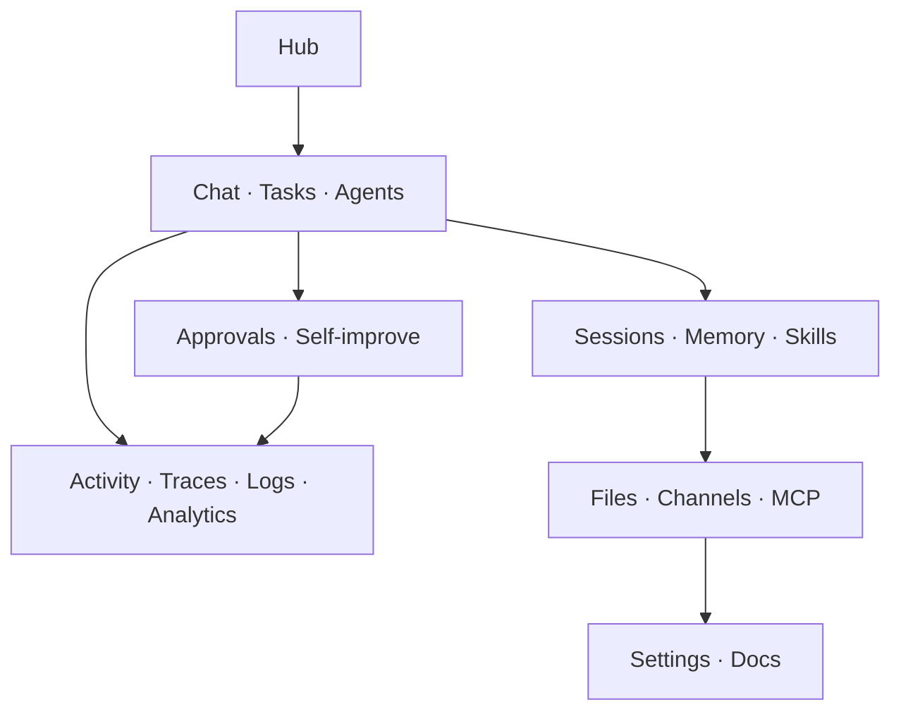

# HiveOS UI relations and backend contract matrix

Status: verified against `docs/UI_MENU_V2.md`, `docs/UI_PLAN.md`, `docs/API.md`, and
the route decorators in `src/hive/gateway/app.py` on 2026-08-22.

This document is the handoff between the UI concept and backend implementation.
The isolated placeholder preview is available in the dashboard with
`?ui-preview=1`. It renders fixture data only and deliberately performs no API calls.
The v0.8.2 deep audit exposes all 29 approved mockup states and makes every tab,
action and documented relationship testable; see `docs/UI_AUDIT_2026-08-22.md`.

## Contract status

| Status | Meaning |
|---|---|
| Implemented | A matching authenticated gateway route exists today. |
| Partial | Some data exists, but the final UI needs a richer resource or action. |
| Gap | No safe, stable gateway contract exists for the UI requirement. |
| Static | Bundled client content; no runtime API is required for v1. |

All gateway calls except `GET /health` require the Hive token. Destructive actions
must use the existing approval policy and a confirmation UI. The UI must never infer
permission from button visibility alone.

## Domain relationships



- Hub summarizes system state and links to the authoritative detail screen. It must
  not become a second copy of every page.
- Chat is the primary work surface. A chat can create tasks, delegate to agents,
  retrieve memory, launch skills, request approvals, and open a trace.
- Sessions are conversation/execution containers. Memory is durable knowledge derived
  from sessions; they are related but not interchangeable.
- Tasks are durable work items. Cron creates scheduled work and Promises represent
  recurring commitments; all three live under one operator intent.
- Activity is a business-event stream. Logs are raw runtime output. Traces are a
  correlated execution timeline. Analytics is aggregated history.
- Approvals are the safety boundary. Self-improve may create reviewable edits, but a
  protected or dangerous change always flows through the approval/PR process.

## Top-level screens

| Screen | UI content | Reads | Writes / actions | Opens / receives context from | Status |
|---|---|---|---|---|---|
| Hub `/` | Gateway, memory, agents, approvals, active work, recent events, connections and sessions | `/health/summary`, `/memory/stats`, `/agents/board`, `/approvals`, `/tasks/running`, `/events/history`, `/sessions` | Consolidate memory; run tests; create task; restart gateway | Opens Chat, Tasks, Activity, Sessions, Approvals, Channels | Partial: `POST /gateway/restart` and direct task creation are gaps |
| Chat `/chat/:sessionId?` | Session rail, readable conversation, tool calls, delegations, task objects, memory/skill context and composer | `/sessions`, `/sessions/{id}`, `/memory/topics`, `/skills`, `/traces/{id}` | `POST /chat/stream/iterations`, title/auto-title, attach file | Opens Memory, Skills, Agent Detail, Task Detail, Approval Modal, Trace Detail | Implemented except file attachment API |
| Memory `/memory` | Two compact health summaries, searchable memory list and one detail inspector | `/memory/stats`, `/memory/important`, `/memory/topics`, `/memory/session/{id}/count` | Consolidate, export, wipe, delete session memory | Opens source Chat session and Activity trace | Implemented for current contract; free-text memory list/search needs a richer query endpoint |
| Skills `/skills` | Pinned/active/stale/archived library, lifecycle and detail modal | `/skills`, `/skills/unused`, `/skills/archived`, `/skills/recent`, `/skills/{name}` | Pin, unpin, archive/state, learned-skill proposal/approval | Launched from Chat; usage appears in Analytics | Implemented |
| Files `/files` | Workspace tree, preview, recent items and file picker | None | Upload, edit, download, create folder | Chat attachments, Docs, Settings root path | Gap |
| Agents `/agents` | Active specialists, all agents, type groups and live state | `/agents/board`; WS `A2A_CALL_*` | Pause, stop, restart | Opens Agent Detail, Tasks and Activity | Partial: board exists; detail/control routes are gaps |
| Tasks `/tasks` | Kanban plus Cron and Promises tabs, queue health and bulk actions | `/tasks`, `/tasks/by-kind`, `/tasks/stats`, `/cron`, `/commitments` | Retry, cancel, requeue; Cron CRUD; Promise create/fulfil/delete | Opens Agents, Activity and Approvals | Partial: task create/update/reorder endpoint is missing |
| Channels `/channels/:platform?` | Telegram, Discord, Slack, Email and Webhooks connection management | `/health/summary.channels` | Test message, edit mapping/settings, webhook CRUD/retry | Opens Activity events and Settings | Partial: status exists; management API is a gap |
| MCP `/mcp` | Servers, exposed tools and health | `/tools`, `/tools/categories`, `/tools/stats` | Add/remove/reconnect server | Opens Skills, Settings and Activity | Partial: tool inventory exists; server management/health API is a gap |
| Logs `/logs` | Gateway, agent, system and self-improve tail with level/source search | `/audit` can approximate structured tool output; WS dashboard events | Pause tail, export, clear with confirmation | Opens Trace Detail and Settings | Gap for actual service logs and export |
| Activity `/activity` | Live, Audit, Traces, Events and Loop-guard | `/audit`, `/audit/search`, `/traces`, `/events/history`, `/events/stats`, `/loop-guard/stats`; WS dashboard | Export audit/trace, reset loop guard | Opens Task, Session, Approval and Trace Detail | Implemented |
| Sessions `/sessions` | All, model, date and error filters; tokens, cost and trace links | `/sessions`, `/sessions/stats`, `/sessions/search`, `/sessions/{id}`, `/v1/models` | Rename, auto-title, delete, export trace | Opens Chat and Trace Detail | Implemented; exact per-session cost depends on stored session payload |
| Approvals `/approvals` | Pending inbox, risk tier, args/reason, edits log and batch controls | `/approvals`, `/approvals/edits` | Decide, cancel, cancel all | Receives from any dangerous tool; opens Activity and Self-improve | Implemented; “approve all safe” requires explicit backend batch semantics |
| Self-improve `/self-improve` | Verdicts, history, pending edits, test runner and learning loop | `/self-improve/status`, `/self-improve/history`, `/self-improve/pending`, `/self-improve/stages`, `/learning/status`, `/learning/history` | Symptom/diagnose, run tests, run learning evaluation | Creates Tasks, Approvals and PR/release records | Implemented |
| Analytics `/analytics` | Cost, tokens, sessions, skill usage and error rate with one primary chart per view | `/telemetry`, `/budget/detail`, `/budget/forecast`, `/budget/warning`, `/audit/error-rate`, `/audit/errors` | Date/filter changes only | Opens Sessions, Skills and Settings | Partial: base aggregates exist; historical time-series/breakdowns need new contracts |
| Docs `/docs/:filename?` | Markdown tree, rendered document, Ctrl-F, protected banners | Build-time markdown bundle | None in v1 | Opens Settings, Self-improve and source files | Static |
| Settings `/settings` | Personal, Account and System; model pool, channels, MCP, safe config and protected references | `/config/summary`, `/config/validate`, `/config/llm`, `/llm/pool`, `/model/catalog`, `/health/summary` | Safe settings updates, env edits, channel/MCP setup | Deep-links to Channels, MCP, Docs and Pairing | Partial: reads exist; safe mutation API and secrets workflow are gaps |

## Subviews and route relationships

| Parent | Subview / route | Purpose | Backend contract |
|---|---|---|---|
| Memory | `/memory` | Recent/all memory | Partial: stats exists; full paginated search/list is a gap |
| Memory | `?tab=important` | High-importance facts | `GET /memory/important` |
| Memory | `?tab=topics` | Topic clusters | `GET /memory/topics` |
| Memory | `?tab=sessions` | Memory counts by session | `GET /memory/session/{session_id}/count` |
| Skills | `/skills` | Pinned skills | `GET /skills` with client filter |
| Skills | `?tab=active` | Active skills | `GET /skills` |
| Skills | `?tab=stale` | Unused/stale skills | `GET /skills/unused` |
| Skills | `?tab=archived` | Archived skills | `GET /skills/archived` |
| Agents | `/agents` | Active now | `GET /agents/board` |
| Agents | `?view=all` | All named specialists | Partial: derive from board/registry; dedicated list is optional |
| Agents | `?view=type` | Group by agent type | Partial: derive client-side if board includes type |
| Agents | `/agents/:agentId` | Task, tools, performance, resources and logs | Gap: agent detail/control contract |
| Tasks | `/tasks` | Kanban | `GET /tasks`, `/tasks/by-kind`; create/reorder gap |
| Tasks | `?tab=cron` | Scheduled jobs | `/cron` CRUD |
| Tasks | `?tab=promises` | Recurring commitments | `/commitments` CRUD/fulfil |
| Channels | `/channels/:platform` | One platform detail | Partial: health only; management gap |
| Channels | `?view=webhooks` | Registered callbacks and delivery log | Gap |
| MCP | `/mcp` | Servers | Gap: `/mcp/servers` |
| MCP | `?view=tools` | Tool inventory | `/tools`, `/tools/categories` |
| MCP | `?view=health` | Connectivity and latency | Partial: `/tools/stats`; server-level health gap |
| Logs | `/logs` | Gateway source | Gap: `/logs/stream?source=gateway` |
| Logs | `?src=agents` | Agent stdout/stderr | Gap |
| Logs | `?src=system` | System lifecycle | Gap |
| Logs | `?src=self` | Self-improve output | Partial: self-improve history is structured, not a log stream |
| Activity | `/activity` | Live event stream | WS `/ws/dashboard` |
| Activity | `?tab=audit` | Searchable tool audit | `/audit`, `/audit/search`, `/audit/export` |
| Activity | `?tab=traces` | Session traces | `/traces`, `/traces/stats`, `/traces/{id}` |
| Activity | `?tab=events` | EventBus history | `/events/history`, `/events/stats` |
| Activity | `?tab=loop-guard` | Repetition guard | `/loop-guard/stats`, `/loop-guard/top-tools`, reset action |
| Sessions | `/sessions` | All sessions | `/sessions`, `/sessions/stats` |
| Sessions | `?tab=model` | Model filter | `/sessions` + `/v1/models` client-side unless server filter is added |
| Sessions | `?tab=date` | Date buckets | Client-side or new query params on `/sessions` |
| Sessions | `?tab=errors` | Failed sessions | Gap unless error state is included in `/sessions` payload |
| Approvals | `/approvals` | Pending inbox | `/approvals` |
| Approvals | `/approvals/:id` | Full request review | Current list payload + decide/cancel actions; dedicated GET is optional |
| Self-improve | `/self-improve` | Verdicts/status | `/self-improve/status`, `/self-improve/stages` |
| Self-improve | `?tab=history` | Full proposal history | `/self-improve/history` |
| Self-improve | `?tab=pending` | Reviewable edits/diffs | `/self-improve/pending` + approvals |
| Self-improve | `?tab=tests` | Isolated test output | `POST /run-tests` |
| Self-improve | `?tab=learning` | Evaluation loop | `/learning/status`, `/learning/history`, `POST /learning/run` |
| Analytics | `/analytics` | Cost | `/telemetry`, `/budget/detail`, `/budget/forecast` |
| Analytics | `?view=tokens` | Token usage | `/telemetry` (aggregate); time-series gap |
| Analytics | `?view=sessions` | Session cost ranking | Partial: join session and telemetry data; dedicated aggregate recommended |
| Analytics | `?view=skills` | Skill usage | Partial: `/skills` exposes usage; historical aggregate recommended |
| Analytics | `?view=errors` | Reliability | `/audit/error-rate`, `/audit/errors` |
| Settings | `/settings` | Personal | Gap: safe persisted personal preferences API |
| Settings | `?tab=account` | Token and integrations | Read-only/safe secret setup flow required |
| Settings | `?tab=system` | Models, config, channels and safety | Read APIs exist; mutation endpoints must be narrowly scoped |

## Overlays and global states

| UI state | Trigger | Required data/action | Notes |
|---|---|---|---|
| Command palette | `⌘K` from any screen | Routes, sessions, skills, approvals, overdue tasks | Client index plus existing list APIs |
| Approval modal | Approval card or WS notification | Request args, reason, risk tier, decide/cancel | Use focus trap, Escape, explicit destructive labels |
| Trace detail | Trace link from Chat, Session or Activity | `/traces/{session_id}`, export | Must preserve the source route when closed |
| New task dialog | Hub or Tasks | Gap: task create contract | Cron and Promise creation already have APIs |
| Notifications panel | Header bell | Approvals, budget, tests, cron, webhooks, pairing | Aggregate client-side initially; notification feed endpoint optional |
| Memory detail | Memory row | Fact text, source, lifecycle and retention | Rich fact identifier/detail contract is currently incomplete |
| Skill detail/editor | Skill card | `/skills/{name}` and state actions | Editing skill contents needs a separately audited contract |
| Session detail | Sessions row | `/sessions/{id}` | Open Chat and Trace are primary actions |
| System health slide-over | Footer/header status | `/health/full`, `/health/summary`, `/system-status` | Read-only except explicit approved restart |
| Pairing QR/request | Footer/avatar | Gap: pairing lifecycle API | Treat device revocation as a sensitive action |
| Confirm dialog | Wipe, delete, reset, cancel-all, restart | Domain action endpoint | Required for every destructive action |

## Mobile relationships

- Desktop and mobile share the same route/data contract. Mobile is not a separate API.
- The 64 px bottom bar exposes Hub, Chat, Tasks, Activity and Settings. The full drawer
  exposes every route and badge.
- Detail inspectors become a push page or bottom sheet; they never squeeze the main list.
- Command palette, approvals and destructive confirmations remain full-screen dialogs.
- Tables collapse to summary rows; secondary columns move into the detail view.

## Backend gaps, ordered by UI impact

| ID | Proposed contract | Required by | Priority | Safety notes |
|---|---|---|---|---|
| UI-B01 | `GET /memory` with query, namespace, importance, source, date, cursor; `GET/PATCH /memory/{id}` | Memory list/detail | P0 | Do not expose raw hidden prompts or secrets; editing needs audit history |
| UI-B02 | `POST /tasks`, `PATCH /tasks/{id}`, optional reorder/state transition | Hub/New Task/Kanban | P0 | Validate kind/source/state; durable and idempotent create |
| UI-B03 | `GET /agents`, `GET /agents/{id}`, narrowly scoped pause/resume/stop | Agents/Agent Detail | P0 | Stop/restart may require approval depending on impact |
| UI-B04 | `GET /files/tree`, `GET /files/content`, upload/download and audited edit | Files/Chat attachments | P0 | Root allowlist, traversal defense, file size/type limits, approval for protected paths |
| UI-B05 | `GET /channels`, `GET/PATCH /channels/{platform}`, test-message action | Channels/Settings | P1 | Never return secrets; external test sends require explicit approval |
| UI-B06 | Webhook registration, delivery log and retry resources | Channels/Webhooks | P1 | Signed callbacks, SSRF protection, retry audit |
| UI-B07 | `GET/POST/DELETE /mcp/servers`, reconnect and health | MCP/Settings | P1 | Audit manifests/commands; never reveal credentials; approval for executable server specs |
| UI-B08 | Authenticated log tail/search/export API | Logs | P1 | Redact secrets before persistence/transport; pagination and bounded tail |
| UI-B09 | Historical telemetry buckets and breakdowns | Analytics | P1 | Cost values need currency/model/time window metadata |
| UI-B10 | Safe settings mutation endpoints split by domain | Settings | P1 | No general arbitrary config write; mask secrets and require re-auth/approval where needed |
| UI-B11 | Pairing request, QR/token, list and revoke | Pairing | P2 | Short TTL, one-time token, explicit revoke audit |
| UI-B12 | `POST /gateway/restart` | Hub/System Health | P2 | Always confirm and route through approval gate |
| UI-B13 | Notification feed/read state | Global notifications | P2 | Can remain client-aggregated for v1 |

## Suggested response envelopes

List resources should use a stable cursor envelope:

```json
{
  "items": [],
  "next_cursor": null,
  "total": 0,
  "updated_at": "2026-08-22T03:42:00Z"
}
```

Long-running writes should return a task reference instead of blocking:

```json
{
  "accepted": true,
  "task_id": "task_8f32",
  "approval_id": null
}
```

Errors should be actionable and stable:

```json
{
  "error": {
    "code": "protected_path",
    "message": "This path cannot be edited from the dashboard.",
    "request_id": "req_18fd"
  }
}
```

## Verification checklist before replacing placeholders

1. Confirm the route exists in `src/hive/gateway/app.py` and is documented in `docs/API.md`.
2. Capture real response fixtures, including empty, loading, partial and error states.
3. Confirm auth, redaction, pagination and approval behavior.
4. Implement the UI against typed adapters, not direct shape assumptions in components.
5. Add component tests for empty/loading/error/success and one integration test per write.
6. Verify mobile layout at 390 px and desktop at 1440 px.
7. Update this matrix, `docs/API.md`, `docs/STATUS.md`, the changelog and release notes in the same PR.
